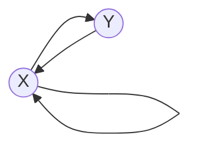

# 1. Relation (Mathmatics)

[Wikipedia](https://en.wikipedia.org/wiki/Relation_(mathematics)) 写得挺好，这里总结一下。

## 1.1 Definition

Given a set $X$, a relation $R$ over $X$ is a set of ordered pairs of elements from $X$, formally: $R \subseteq \lbrace (x,y) \mid x, y \in X \rbrace$.

- 你也可以扩展成 $R \subseteq \lbrace (x,y) \mid (x,y) \in X \times Y \rbrace$，但这么定义就排除了 $(y,x)$ 形式的元素 (类型不匹配)

$(x,y) \in R$ 也可以写作 infix 形式 $xRy$，意思就是 "$x,y$ 满足 $R$ 关系"。

## 1.2 Representation of Relations

如果 $X$ 是一个 discrete 的集合，$R$ 的 size 有限，那么可以 R 可以表示成：

1. directed graph: 每一组 $xRy$ 都用一条 $x \to y$ 的 edge 表示
2. boolean matrix: 每一组 $xRy$ 都表示 $M_{x,y} = 1$，矩阵 $M$ 总没有填 1 的部分默认都是 0

如果 $X$ 是 $\mathbb{R}$：

- 每一组 $xRy$ 都可以看作是坐标系下的一个点，所以 $R$ 也可以表示成一个 2D plot
    - 比如 $R = \lbrace (x,y) \mid x^2 + y^2 = 1 \rbrace$

## 1.3 Properties of Relations

### 1.3.1 Reflexivity

**Reflexive:** $\forall x \in X, xRx$

**Irreflexive:** $\forall x \in X, x \cancel{R} x$

- $\cancel{R}$ 是我自创的符号，表示 "不满足 $R$ 关系"
- 我们可以完全不用它的英文名字，也不用管中文翻译 (因为后面对称性的命名简直灾难！)，结合 boolean matrix representation 来记忆：
  - **reflexive** 就是主对角线全是 1，比如 $M_1$
  - **irreflexive** 就是主对角线全是 0，比如 $M_2$

$$
M_1 = \begin{bmatrix}
1 & - & -\\
- & 1 & -\\
- & - & 1
\end{bmatrix} \,\,\,\,

M_2 = \begin{bmatrix}
0 & - & -\\
- & 0 & -\\
- & - & 0
\end{bmatrix}
$$

我们说这组 properties 是 non-exhausitive 的，意思是 $\exists R$ 既不是 reflexive 也不是 irreflexive 的，结合 boolean matrix representation 很容易举出一个反例。

### 1.3.2 Symmetry

**Symmetric:** $\forall x,y \in X$, $xRy \implies yRx$

**Asymmetric:** $\forall x,y \in X$, $xRy \implies y \cancel{R} x$

**Antisymmetric:** $\forall x,y \in X$, $xRy \land yRx \implies x = y$

这个混乱的命名，我觉得背后的逻辑是：

1. 从定义的形式上来看，symmetric 的定义直接加个否定就变成了 asymmetric，非常的漂亮
2. 但这么定义下的 asymmetric 暗含了 irreflexive (因为你不可能同时有 $xRx$ 和 $x \cancel{R} x$)，有点过于 strong
3. relax 一下，不要求 irreflexive 的非对称，就变成了 antisymmetric

还是结合 boolean matrix representation 记忆：

1. symmetric 就是 $M_{i,j} = M_{j,i}$，主对角线上随意，比如 $M_1$
2. asymmetric 就是 $M_{i,j} \neq M_{j,i}$，主对角线上全是 0，比如 $M_2$
3. antisymmetric 就是 $M_{i,j} \neq M_{j,i}$，但主对角线上随意，比如 $M_3$

$$
M_1 = \begin{bmatrix}
- & \alpha & \beta\\
\alpha & - & \gamma\\
\beta & \gamma & -
\end{bmatrix} \,\,\,\,

M_2 = \begin{bmatrix}
0 & \overline\alpha & \overline\beta\\
\alpha & 0 & \overline\gamma\\
\beta & \gamma & 0
\end{bmatrix} \,\,\,\,

M_3 = \begin{bmatrix}
- & \overline\alpha & \overline\beta\\
\alpha & - & \overline\gamma\\
\beta & \gamma & -
\end{bmatrix} \,\,\,\,
$$

:star2: 定义上有：asymmetric $\equiv$ antisymmetric $\land$ irreflexive

同样，这组 properities 也不是 exhausitive 的，结合 boolean matrix representation 也很容易举出反例。

### 1.3.3 Transitivity & Connectedness

**Transitive:** $\forall x,y,z \in X$, $xRy \land yRz \implies xRz$

**Connected:** $\forall x,y \in X$, $x \neq y \implies$ $xRy$ or $yRx$. Or equivalently $\forall x,y \in X$, $xRy$ or $yRx$ or $x=y$

**Strongly Connected:** $\forall x,y \in X$, $xRy$ or $yRx$

考虑 transitive 的特殊情况：

1. if $x = y = z$，obvious implication
2. if $x = y \neq z$，obvious implication
3. if $x = z \neq y$，transitive 等价于：如果有 $x \to y \to x$ 这样一个 loop，那么就会有 $x \to x$ 的 self loop
4. if $x \neq y = z$, obvious implication

:star2: 定义上有：transitive $\land$ irreflexive $\equiv$ transitive $\land$ asymmetric

Proof: (1) 假定 $R$ 是 transitive $\land$ irreflexive. 假定 $\exists x,y \in X$ 同时满足 $xRy$ 和 $yRx$ (从而不满足 asymmetric)

根据 transitive 定义，$xRy \land yRx \implies xRx$，不满足 irreflexive，矛盾。所以 R 一定满足 asymmetric

(2) 假定 $R$ 是 transitive $\land$ asymmetric. 因为 asymmetric implies irreflexive，所以 $R$ 一定是 irreflexive. $\blacksquare$

结合 2D plot representation 考虑 connected 和 strongly connected:

1. connected 就是指 $\forall$ 任意两个 node $x,y$，至少有一条 edge 连接它们。可以是 $x \to y$，可以是 $y \to x$，或者 both
2. connected 并不要求有 self loop
3. strongly connected 就是 connected 并要求 $\forall x \in X$，都要有一个 $x \to x$ 的 self loop

:star2: 定义上有：connected $\land$ reflexive $\equiv$ strongly connected 

### 1.3.4 Uniqueness

**Injective:** (a.k.a. **left-unique**) $\forall x,y,z \in X$, $xRz \land yRz \implies x = y$

**Functional:** (a.k.a. **right-unique**) $\forall x,y,z \in X$, $xRy \land xRz \implies y = z$

- Such a relation is also called a **partial function**

### 1.3.5 Totality

**Serial:** (a.k.a. **left-total**, or simply **total**) $\forall x \in X$, 一定 $\exists y \in X$ such that $xRy$

- 注意它并没有限定 $y$ 的个数，可以有多个 $y_i$ 都满足 $xRy_i$，至少有一个
- Such a relation is also called a **multivalued function**
- 我觉得 serial 的意思是：从一个起始 $x_0$ 出发，不断找 $x_iRx_{i+1}$，能得到一个 $x_0 x_1 x_2 \dots$ 的 sequence
  - The successor function used by Peano to define natural numbers is the prototype for a serial relation.

**Surjective:** (a.k.a **right-total**) $\forall y \in Y$, 一定 $\exists x \in X$ such that $xRy$ (扩展定义 $R \subseteq X \times Y$)

### 1.3.6 Special Relations / Combinations of Properties

Orderings:

$$
\begin{aligned}
\textbf{Equivalence Relation} &\equiv R \text{ which is } \textit{ reflexive } \land \textit{ symmetric } \land \textit{ transitive } \\
\textbf{Partial Order} &\equiv R \text{ which is } \textit{ reflexive } \land \textit{ antisymmetric } \land \textit{ transitive } \\
\textbf{Strict Partial Order} &\equiv R \text{ which is } \textit{ irreflexive } \land \textit{ asymmetric } \land \textit{ transitive } \\
\textbf{Total Order} &\equiv R \text{ which is } \textit{ reflexive } \land \textit{ antisymmetric } \land \textit{ transitive } \land \textit{ connected } \\
\textbf{Strict Total Order} &\equiv R \text{ which is } \textit{ irreflexive } \land \textit{ asymmetric } \land \textit{ transitive } \land \textit{ connected }
\end{aligned}
$$

- 我个人认为 equivalence 可以看作是 "没有任何 order"
- partial 的意思是 "允许存在两个元素没有 order (i.e. non-comparable)"
- total 的意思是 "任意的两个元素间都有 order (i.e. comparable)"

举例：

- **Equivalence Relation:** equality $=$
- **Partial Order:** subset $\subseteq$
- **Strict Partial Order:** strict subset $\subset$
- **Total Order:** less than or equal to $\leq$
- **Strict Total Order:** less than $<$

:star2: Lemma: An $R$ which is symmetric, transitive, and serial is an equivalence relation.

Proof: 由 serial 可知 $\forall x \in X, \exists y$ such that $xRy$. 

再加上 symmetric，可知 $\forall x \in X, \exists y$ such that $xRy$ and $yRx$.

再加上 transitive，可知 $\forall x \in X, xRx$, 得到 reflexive. $\blacksquare$

Uniqueness 性质的组合：

$$
\begin{aligned}
\textbf{One-to-one} &\equiv R \text{ which is } \textit{ injective } \land \textit{ functional } \\
\textbf{One-to-many} &\equiv R \text{ which is } \textit{ injective } \land \neg \textit{ functional } \\
\textbf{Many-to-one} &\equiv R \text{ which is } \neg \textit{ injective } \land \textit{ functional } \\
\textbf{Many-to-many} &\equiv R \text{ which is } \neg \textit{ injective } \land \neg \textit{ functional }
\end{aligned}
$$

Uniqueness + Totality 性质的组合：

$$
\begin{aligned}
\textbf{Function} &\equiv R \text{ which is } \textit{ right-unique (functional) } \land \textit{ left-total (serial) } \\
\textbf{Injection} &\equiv F \text{ which is } \textit{ left-unique (injective) } \\
\textbf{Surjection} &\equiv F \text{ which is } \textit{ right-total (surjective) } \\
\textbf{Bijection} &\equiv F \text{ which is } \textit{ left-unique (injective) } \land \textit{ right-total (surjective) }
\end{aligned}
$$

where $F$ is a $\textbf{Function}$.

# 2. Asymptotic Notations

## 2.1 Definitions

假定有 functions $f,g: \mathbb{Z}^{+} \to \mathbb{R}^{+} \cup \lbrace 0 \rbrace$

**Big-Oh Notation:** $f = O(g)$ if $\exists$ constant $c > 0$ and $\exists n_0$ such that $\forall n \geq n_0$, $f(n) \leq c \cdot g(n)$

- 这个 $n_0$ 是一个 threshold，表示 "$f(n) \leq c \cdot g(n)$" 这个关系是 "当 $n$ 充分大、足够大以后" 才出现的

**Big-Omega Notation:** $f = \Omega(g)$ if $\exists$ constant $c > 0$ and $\exists n_0$ such that $\forall n \geq n_0$, $f(n) \geq c \cdot g(n)$

**Big-Theta Notation:** $f = \Theta(g)$ if $f = O(g) \land f = \Omega(g)$

- 换言之，$f = \Theta(g)$ if $\exists$ constants $c_1, c_2 > 0$ and $\exists n_0$ such that $\forall n \geq n_0$, $c_1 \cdot g(n) \leq f(n) \leq c_2 \cdot g(n)$

**Little-oh Notation:** $f = o(g)$ if $\forall$ constant $c > 0$, $\exists n_0$ such that $\forall n \geq n_0$, $f(n) < c \cdot g(n)$

**Little-omega Notation:** $f = \omega(g)$ if $\forall$ constant $c > 0$, $\exists n_0$ such that $\forall n \geq n_0$, $f(n) > c \cdot g(n)$

## 2.2 Problem with those Notations

[Knuth describes such notations as "one-way equalities", since if the sides could be reversed](https://en.wikipedia.org/wiki/Big_O_notation#Equals_sign):

> "... we could deduce ridiculous things like $n = n^2$ from the identities $n = O(n^2)$ and $n^2 = O(n^2)$."
>   
> "... the equality sign is not symmetric with respect to such notations."
>   
> "... mathematicians customarily use the $=$ sign as they use the word *is* in English: Aristotle is a man, but a man isn't necessarily Aristotle."

所以有的教材会写成 $f \in O(g)$，也就是把 $O(g)$ 理解成一个 function 的集合 (或者 equivalence class)。但还是不如从 relation 的角度来理解 asymptotic notations (我就是为了这口醋包了前面那么多饺子)。

## 2.3 Asymptotic Relations

:star2: Lemma: Big-Oh is a **Partial Order**.

Proof: (1) $O$ is reflexive, obviously.

(2) $O$ is antisymmetric, obviously.

(3) $O$ is transitive, obviously.

(4) $O$ is not connected. I.e. $\exists f,g$ such that $f \cancel{O} g$ and $g \cancel{O} f$. 

E.g. 

$$
\begin{aligned}
f(n) &= \begin {cases} 1&n\text{ is even}\\n&n\text{ is odd} \end {cases} \newline
g(n) &= \begin {cases} n&n\text{ is even}\\1&n\text{ is odd} \end {cases}
\end{aligned}
$$

E.g.

$$
\begin{aligned}
f(n) &= 1 + n + n \times (-1)^n \newline
g(n) &= 1 + n - n \times (-1)^n
\end{aligned}
$$

$\blacksquare$

:star2: Lemma: Big-Omega is a **Partial Order**.

:star2: Lemma: Big-Theta is a **Equivalence Relation**.

Proof: (1) $\Theta$ is reflexive, obviously.

(2) $\Theta$ is symmetric.

If $f \Theta g$, then $\exists$ constants $c_1, c_2 > 0$ and $\exists n_0$ such that $\forall n \geq n_0$, $c_1 \cdot g(n) \leq f(n) \leq c_2 \cdot g(n)$.

At the same time, we have $\frac{1}{c_2} \cdot f(n) \leq g(n) \leq \frac{1}{c_1} \cdot f(n)$, so $g \Theta f$.

(3) $\Theta$ is transitive.

If $f \Theta g$, then $\exists$ constants $c_1, c_2 > 0$ and $\exists n_0$ such that $\forall n \geq n_0$, $c_1 \cdot g(n) \leq f(n) \leq c_2 \cdot g(n)$.

If $g \Theta h$, then $\exists$ constants $c_3, c_4 > 0$ and $\exists n_1$ such that $\forall n \geq n_1$, $c_3 \cdot h(n) \leq g(n) \leq c_4 \cdot h(n)$.

Therefore $\exists n_{\ast} = \max(n_0, n_1)$ such that $\forall n \geq n_{\ast}$, $c_1 \cdot c_3 \cdot h(n) \leq f(n) \leq c_2 \cdot c_4 \cdot h(n)$. I.e. $f \Theta h$. $\blacksquare$

:star2: Lemma: Little-oh is a **Strict Partial Order**.

:star2: Lemma: Little-omega is a **Strict Partial Order**.