书接上回 [Ken Thompson’s `re2post` Algorithm](/compiler/2025/03/27/ken-thompsons-re2post-algorithm).

-----

# 1. 我放弃了原始的 C 代码

实在是太难读了，你自己用 python 写一版都算是节约时间的。

# 2. NFA is somewhat like a Linked-List, data structure-wise

## 2.1 把 `State` 理解成 `Node`

linked-list 中常见的 node 写法：

```c
struct Node {
  int data;
  struct Node* next;
};
```

那 state 也是类似的，假设它有一个 `symbol` 且只有 1 个 `next` state:

```python
class State:
    def __init__(self, _symbol: str, _next: `State` = None):
        self.symbol = _symbol
        self.next = _next
```

## 2.2 `State` $q$ 相当于是自带了 transition $\delta(q, q.\text{symbol}) = q.\text{next}$

data structure-wise 我们还是要和 automata theory 的 state 区分一下：

- automata theory 里：丁是丁，卯是卯；$q \in Q$ 和 $\delta(q, \cdot) = q'$ 是独立的
- data structure-wise 我们是把 state 和其上的 transition 合并到了 `class State` 中，`State` $q$ 相当于是自带了 transition $\delta(q, q.\text{symbol}) = q.\text{next}$

## 2.3 只需要 3 类 states

算法用的是 [Thompson's construction](https://en.wikipedia.org/wiki/Thompson%27s_construction) 的思路，且最终只用了 3 类 states.

一是 "consume 一个 symbol，然后 transition 到 next state" 的 `LiteralState`:

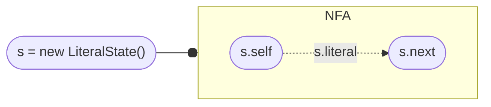

二是 "两个 $\varepsilon$-transition 到两个 next states" 的 `SplitState`:

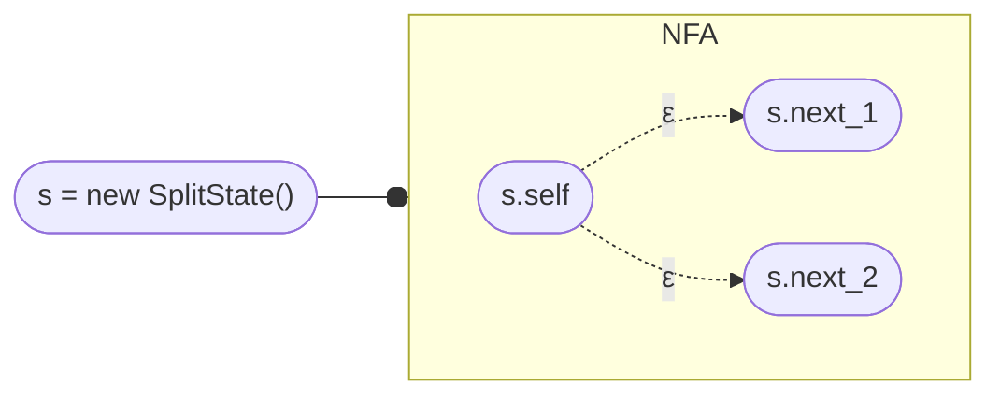

- 可以默认 `SplitState` 只有 $\varepsilon$-transition，所以可以不用把 $\varepsilon$ 保存为一个 field

三是 `AcceptState` (i.e. $q_f \in F$):

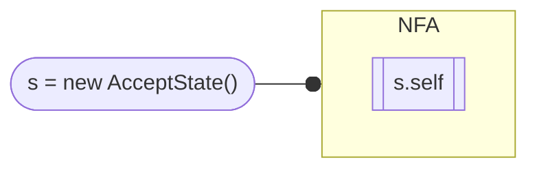

- 理论上我们可以做到让 NFA 只有一个 accept state：假设你有多个 accept state $q_i$，我们就创建一个 dummy 的 accept state $q_f$，然后把所有的 $q_i$ 都 $\varepsilon$-transition 到 $q_f$
- 我们这里的代码也只会使用到一个 accept state

## 2.4 把 `NFA` 理解成 `LinkedList`

我们一般会用 `Node* head` 来 represent 整个 linked list，但如果你经常要做 "concat 链表" 这个操作的话，我们用 `Node* head` 和 `Node *tail` 一起来表示一个 linked list 会更方便 (省得你每次 concat 都要从 `head_1` 遍历到 `tail_1`，然后再把 `tail_1` 接到 `head_2`):

```c
struct LinkedList {
    Node* head,
    Node* tail,
};
```

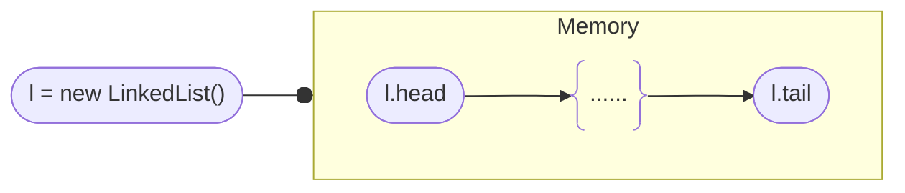

同理，我们也可以用 "一个 `head` + 一组 `tails`" 来表示一个 "NFA 半成品"，即还没有用 accept state 封口的 NFA:

- 我们称这样的 NFA 为 `open NFA`，把 `head` 改名为 `start`，把 `tails` 改名为 `open_ends`
- 如果我们把一个 `open NFA` 的所有 `open_ends` 都连接到一个 accept state，那么它就变成了一个 `close NFA`

原代码中这个数据结构的名字是 `Frag`，表示是一个 NFA 的 fragment. 我觉得不如直接叫 `NFA` 好了，加上 open/closed 性质区分一下更好理解。
{: .notice--info}

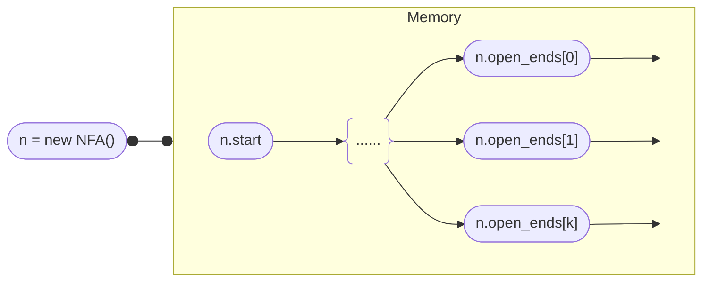

```python
class Nfa:
    """
    A partially built NFA nfa without a accept state.
    - start: starting state of the nfa
    - ends: list of open States that need to be connected
    """
    def __init__(self, start: State, open_ends: list[State], accept: State = None):
        self.start = start
        self.open_ends = open_ends
        self.accept = accept

    def is_open(self):
        return self.open_ends and (self.accept == None)
    
    def is_closed(self):
        return not self.is_open()
```

# 3. Construction

算法框架是：

```python
def post2nfa(postfix: str):
    if postfix is None:
        return None

    for c in postfix:
        if c == '.':  # Concatenation
            # TODO
        elif c == '|':  # Alternation
            # TODO
        elif c == '?':  # Zero or one
            # TODO
        elif c == '*':  # Zero or more
            # TODO
        elif c == '+':  # One or more
            # TODO
        else:  # Literal character
            # TODO

    # TODO add an accept state to NFA

    return nfa
```

诀窍是：利用 stack！

## 3.1 Literal

是最简单的 case：我们直接做一个 `LiteralState`，然后把它 wrap 成一个 "只有 1 个 state 的 NFA"，并把这个 NFA 压入 stack：

```python
s = LiteralState(c, None)
            
# The nfa is just this state with one open end
n = Nfa(s, [s])
component_stack.append(n)
```

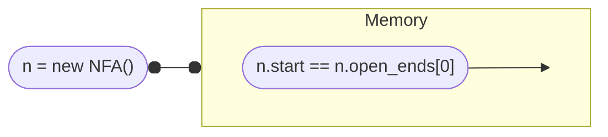

## 3.2 Quantification

### 3.2.1 `?`: Zero or One

假定我们有 `input = <expr>?`，且 `<expr>` 已经对应了一个 NFA `n1`，它理应在 stack 中，我们先把 `n1` 从 stack 中弹出。

我们可以加一个 `SplitState s`，使其一条路径经过 `n1`，另一条路径不经过 `n1`:

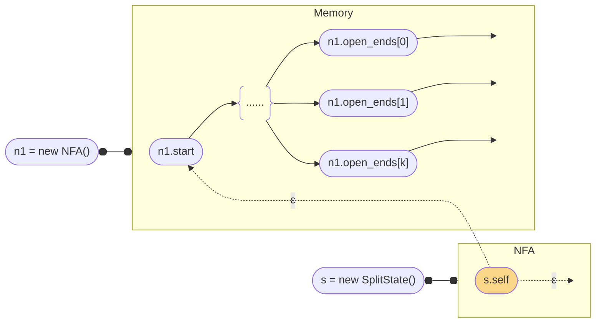

然后我们新建一个 NFA `n2`，使其：

- `n2.start = s`
    - 即新 NFA 要从 `s` 开始 (图中用土黄色 state 表示；下同)
- `n2.open_ends = n1.open_ends + [s]`
    - 这里假设我们把 `s.next_2` 接到了 `n1.start`
    - 于是 `s.next_1 == None`，所以 `s` 也是个 open end

然后我们再把 `n2` 压入 stack.

### 3.2.2 `*`: Zero or More

假定我们有 `input = <expr>*`，且 `<expr>` 已经对应了一个 NFA `n1`，它理应在 stack 中，我们先把 `n1` 从 stack 中弹出。

和 `?` 的处理非常类似：我们可以加一个 `SplitState s`，使其一条路径经过 `n1`，另一条路径不经过 `n1`；但要额外让 `n1.open_ends` 接到 `s` 上构成 loop:

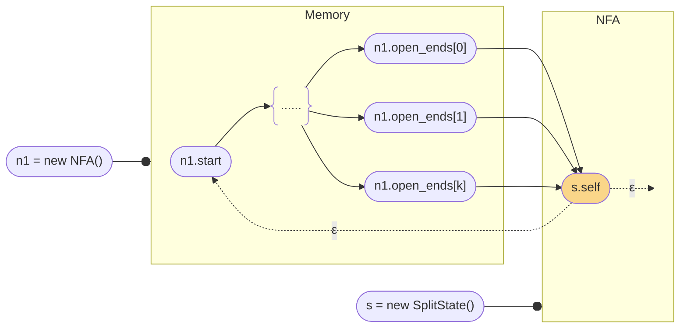

此时我们可以选择新建一个 NFA `n2` 或者复用 `n1`，只需要满足：

- 以 `s` 开始
- `s` 是唯一的 open end

然后我们把这个新的 `n2` 或者修改过的 `n1` 压入 stack.

### 3.3.3 `+`: One or More

假定我们有 `input = <expr>+`，且 `<expr>` 已经对应了一个 NFA `n1`，它理应在 stack 中，我们先把 `n1` 从 stack 中弹出。

和 `*` 的构造一模一样，只是这次我们的新 NFA 要从 `n1` 开始：

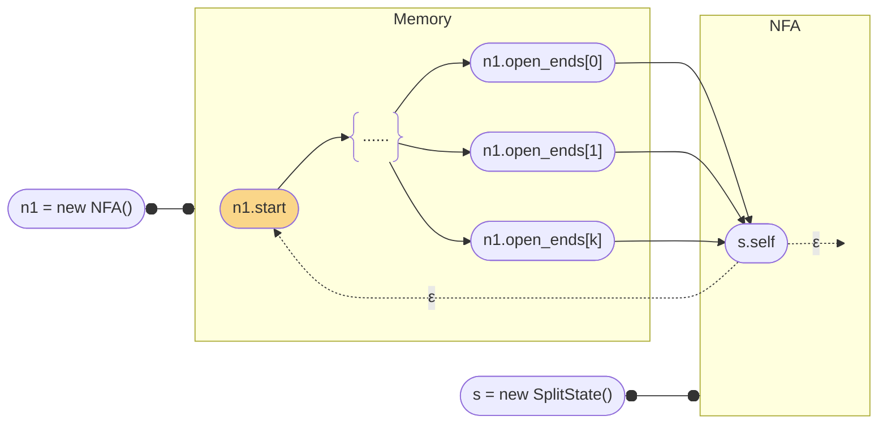

此时我们可以选择新建一个 NFA `n2` 或者复用 `n1`，只需要满足：

- 以 `n1.start` 开始
- `s` 是唯一的 open end

然后我们把这个新的 `n2` 或者修改过的 `n1` 压入 stack.

## 3.3 Alteration

假定我们有 `input = <expr1> <expr2> |`，且 `<expr1>` 已经对应了一个 NFA `n1`，`<expr2>` 已经对应了一个 NFA `n2`，它们理应在 stack 中，我们把 `n1` 和 `n2` 都从 stack 中弹出。

我们可以加一个 `SplitState s`，使其一条路径经过 `n1`，另一条路径经过 `n2`:

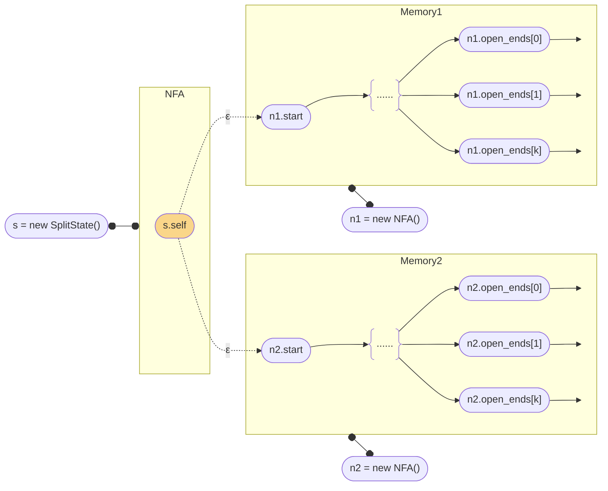

我们新建一个 NFA `n3`，使其：

- `n3.start = s`
- `n3.open_ends = n1.open_ends + n2.open_ends`

然后我们把这个新的 `n3` 压入 stack.

## 3.4 Concatenation

假定我们有 `input = <expr1> <expr2> .`，且 `<expr1>` 已经对应了一个 NFA `n1`，`<expr2>` 已经对应了一个 NFA `n2`，它们理应在 stack 中，我们把 `n1` 和 `n2` 都从 stack 中弹出。

此时我们只要把 `n1` 和 `n2` 连起来即可：

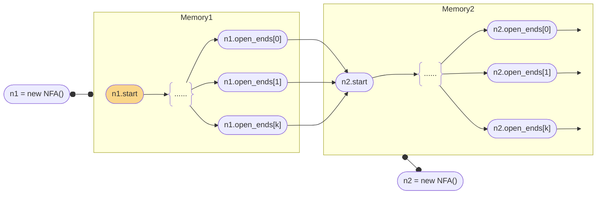

此时我们可以选择新建一个 NFA `n3` 或者复用 `n1`，只需要满足：

- 以 `n1.start` 开始
- `n2.open_ends` 是新的 open end

然后我们把这个新的 `n3` 或者修改过的 `n1` 压入 stack.

## 3.5 Acceptance

把 `input` 处理完之后，stack 应该只有一个 NFA `n`，我们把它从 stack 中弹出，把它所有的 open ends 都连到一个 accept state 即可。

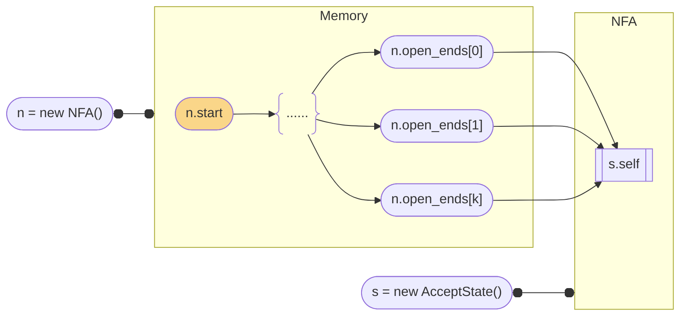

# 4. 成品

[post2nfa.py](https://github.com/erikyao/regexp_demo/blob/main/src/post2nfa.py)