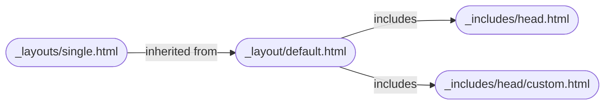
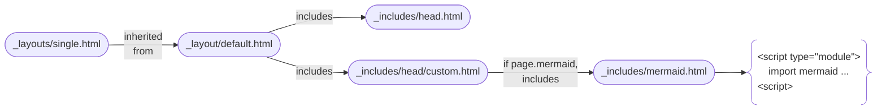

# best place to config Mermaid.js 

Thanks to Minimal Mistakes, it's [_includes/head/custom.html](https://github.com/mmistakes/minimal-mistakes/blob/master/_includes/head/custom.html). Why? See [doc](https://mmistakes.github.io/minimal-mistakes/docs/layouts/#head).

The inheritance and inclusion relationships between the pages involved in my case are:



where "single" is my default layout for posts.

[_includes/head/custom.html](https://github.com/mmistakes/minimal-mistakes/blob/master/_includes/head/custom.html) is a simple blank page, so once you check it out into your own repo, you don't have to worry about syncing with Minimal Mistakes.

# how to config

In my own [_includes/head/custom.html](https://github.com/erikyao/erikyao.github.io/blob/master/_includes/head/custom.html) I added:

```html

    

```

which means:

1. the real configuration goes into a separate `_includes/mermaid.html` ([example](https://github.com/erikyao/erikyao.github.io/blob/master/_includes/mermaid.html))
2. only when a post has `mermaid: true` in its frontmatter, Mermaid.js is loaded for rendering

In `_includes/mermaid.html`, configuration goes like:

```js
<script type="module">
    import mermaid from 'https://cdn.jsdelivr.net/npm/mermaid@11.6.0/+esm'
    let config = { 
        startOnLoad: true,
        
        theme: "neutral",
        themeVariables: {
            fontSize: '1em',  // Default is 16px
            fontFamily: 'Menlo, Consolas, Monaco, "Ubuntu Mono", monospace'
        },

        flowchart: { 
            useMaxWidth: true,  // Respect container width
            htmlLabels: true  // Enable HTML in node labels (for formatting)
        } 
    };
    mermaid.initialize(config);
    await mermaid.run({
        nodes: document.querySelectorAll('.language-mermaid'),
    });
</script>
```

Note that: 

- You may find many articles/LLMs recommend using `mermaid.init()`, but this method is already [deprecated](https://mermaid.js.org/config/usage.html#calling-mermaid-init-deprecated) in Mermaid.js v10.
- Instead you should call `mermaid.run()` on every `<pre class="language-mermaid">` tag, which is translated directly from a respective `` ```mermaid``-marked Markdown code block. See [doc](https://mermaid.js.org/config/usage.html#using-mermaid-run).

The whole picture of the configuration is like:

