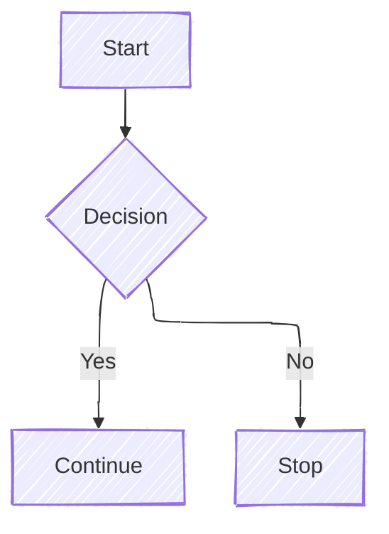

# best place to config Mermaid.js 

Thanks to _Minimal Mistakes_, it's [_includes/head/custom.html](https://github.com/mmistakes/minimal-mistakes/blob/master/_includes/head/custom.html). Why? See [doc](https://mmistakes.github.io/minimal-mistakes/docs/layouts/#head).

[_includes/footer/custom.html](https://github.com/mmistakes/minimal-mistakes/blob/master/_includes/footer/custom.html) is another good option.
{: .notice--info}

The inheritance and inclusion relationships between the pages involved in my case are:


where `single` is my default layout for posts.

[_includes/head/custom.html](https://github.com/mmistakes/minimal-mistakes/blob/master/_includes/head/custom.html) is a simple blank page, so once you check it out into your own repo, you don't have to worry about syncing with Minimal Mistakes.

# how to config

In my own [_includes/head/custom.html](https://github.com/erikyao/erikyao.github.io/blob/master/_includes/head/custom.html) I added:

```html

    

```

which means:

1. the real configuration goes into a separate `_includes/mermaid.html` ([example](https://github.com/erikyao/erikyao.github.io/blob/master/_includes/mermaid.html))
2. only when a post has `mermaid: true` in its frontmatter, _mermaid.js_ is loaded for rendering

In `_includes/mermaid.html`, configuration goes like:

```js
<script type="module">
    import mermaid from "https://cdn.jsdelivr.net/npm/mermaid@latest/dist/mermaid.esm.min.mjs"
    import elkLayouts from "https://cdn.jsdelivr.net/npm/@mermaid-js/layout-elk@latest/dist/mermaid-layout-elk.esm.min.mjs"

    // register ELK
    mermaid.registerLayoutLoaders(elkLayouts)

    let config = { 
        startOnLoad: true,
        
        theme: "neutral",
        themeVariables: {
            fontSize: '1em',  // Default is 16px
            fontFamily: 'Menlo, Consolas, Monaco, "Ubuntu Mono", monospace'
        },

        flowchart: { 
            useMaxWidth: true,  // Respect container width
            htmlLabels: true  // Enable HTML in node labels (for formatting)
        } 
    };
    mermaid.initialize(config);
    await mermaid.run({
        nodes: document.querySelectorAll('.language-mermaid'),
    });
</script>
```

Note that: 

- You may find many articles/LLMs recommend using `mermaid.init()`, but this method is already [deprecated](https://mermaid.js.org/config/usage.html#calling-mermaid-init-deprecated) in _mermaid.js v10_.
- Instead you should call `mermaid.run()` on every `<pre class="language-mermaid">` tag, which is translated directly from a respective <code>```mermaid</code>-marked Markdown code block. See [doc](https://mermaid.js.org/config/usage.html#using-mermaid-run).

The whole picture of the configuration is like:


# how to use `elk` layout algorithm

_mermaid.js_' default layout algorithm is `Dagre`, but the optional `elk` (Eclipse Layout Kernel) layout algorithm offers optimized arrangement, potentially reducing overlapping and improving readability. (Great if you want smaller graphs.)

Now according to [How to Select a Layout Algorithm](https://mermaid.js.org/intro/syntax-reference.html#how-to-select-a-layout-algorithm), you can config using `elk` (and some other styling) with YAML frontmatter right above your embedded mermaid code. E.g.

```md
---
config:
  layout: elk
  look: handDrawn
---
flowchart TB
  A[Start] --> B{Decision}
  B -->|Yes| C[Continue]
  B -->|No| D[Stop]
```



In comparison:

```md
flowchart TB
  A[Start] --> B{Decision}
  B -->|Yes| C[Continue]
  B -->|No| D[Stop]
```


However, the importing of `elk` javascript module is not well documented. I found the working solution from [Issue#5969 - live editor uses layout: elk for adaptive rendering. This isn't documented anywhere](https://github.com/mermaid-js/mermaid/issues/5969#issuecomment-2645923926).

# rendering issue under Safari

Safari's module loader is more sensitive to timing issues. The interaction between `startOnLoad` and manual initialization may create race conditions that Safari handles less gracefully.

A workaround is to wrap the initialization code into a IIFE (Immediately Invoked Function Expression), and add `document` ready state check:

```js
<script type="module">
    import mermaid from "https://cdn.jsdelivr.net/npm/mermaid@latest/dist/mermaid.esm.min.mjs"
    import elkLayouts from "https://cdn.jsdelivr.net/npm/@mermaid-js/layout-elk@latest/dist/mermaid-layout-elk.esm.min.mjs"
    (async () => {
        // register ELK
        mermaid.registerLayoutLoaders(elkLayouts)

        let config = { 
            startOnLoad: false,
            theme: "neutral",
            themeVariables: {
                nodeBorder: '#FF6B6B',  // Red border for nodes
                fontSize: '1em',  // Default is 16px
                fontFamily: 'Menlo, Consolas, Monaco, "Ubuntu Mono", monospace'
            },
            flowchart: { 
                useMaxWidth: true,  // Respect container width
                htmlLabels: true  // Enable HTML in node labels (for formatting)
            } 
        };

        mermaid.initialize(config);
        
        if (document.readyState === 'loading') {
            document.addEventListener('DOMContentLoaded', async () => {
                await mermaid.run({
                    nodes: document.querySelectorAll('.language-mermaid'),
                });
            });
        } else {
            await mermaid.run({
                nodes: document.querySelectorAll('.language-mermaid'),
            });
        }
    })();
</script>
```