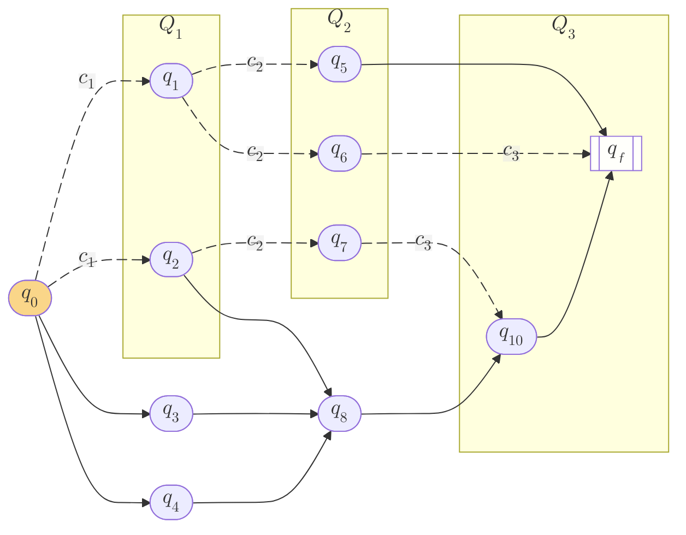
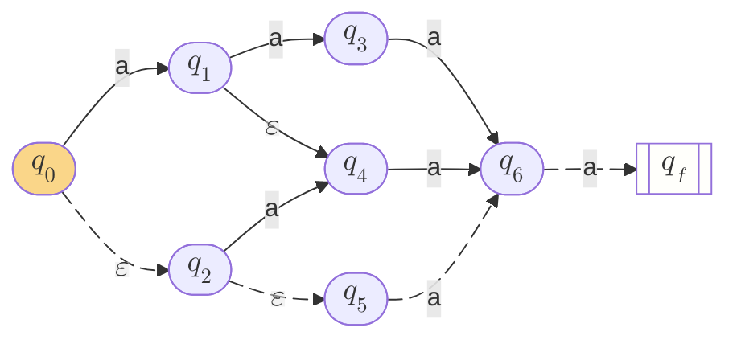

# 0. Retrospect

书接前两回：

1. [Ken Thompson’s `re2post` Algorithm](/compiler/2025/03/27/ken-thompsons-re2post-algorithm)
2. [Ken Thompson’s `post2nfa` Algorithm](/compiler/2025/03/30/ken-thompsons-post2nfa-algorithm)

有一个问题我们很早就应该讨论的，那就是：为啥我们选择用 $\varepsilon$-NFA 去做 regex matching，而不是用 DFA 去做？这里涉及一个 trade-off:

- DFA simulation 的效率高 (因为 deterministic)，但是 DFA 构造的难度大
- NFA simulation 的效率低，但是 NFA 构造的难度低

《编译原理 (第 2 版）》3.7.5 节说：

> 如果字符串处理器被频繁使用，比如词法分析器，那么转换到 DFA 时付出的任何代价都是值得的。然而在另一些字符串处理应用中，例如 grep，用户指定一个正则表达式，并在一个或多个文件中搜索这个表达式所描述的模式，那么跳过构造的 DFA 步骤直接模拟 NFA 可能更加高效。

# 1. 原 C 代码的逻辑其实不复杂，就是 Set + $\varepsilon$-closure + BFS

## 1.1 `struct List` $\Rightarrow$ Set + $\varepsilon$-closure

原 C 代码看起来非常的繁琐，但其实它很大一部分 `struct List` 的代码，其实就是要实现 `set` + $\varepsilon$-closure 的逻辑。

我们还是先来解密一下 variable names:

- `listid` $\Rightarrow$ `traversal_step`
    - `struct List` 并没有这么 `listid` 这么个 field
    - 这个外部的 `listid` 是我们在计算 $\varepsilon$-closure 时的一个 versioning 计数，即：
        - 假设我们用 DFS 计算 $\varepsilon$-closure，从 root 出发，我们每处理完一棵 subtree，我们就给 `lastid += 1`
        - `List l1, l2` 在计算 $\varepsilon$-closure 的过程中，它们只是 content 变了，它们不知道 `lastid` 的变化
- `state.lastlist` $\Rightarrow$ `state.last_traversal_step`
    - `struct State` 用 `lastlist` 来记录 state 是在哪一步被计入 list (也就是 closure 的)
    - 也能实现 loop detection 和 dedup
        - 如果存在一个 $\varepsilon$-loop，那么 loop 上的所有 states 都是在同一步被加入 list 的，所以它们的 `lastlist` 应该相同
        - 如果 DFS 跑完了一整个 $\varepsilon$-loop，那么循环到 loop 开头时，state 的 `lastlist` 一定是已经有值了，而且等于当前的 `listid`
            - 此时我们就能判定 loop 已经跑完，可以 stop 了
            - 而且 list 内也不会有 duplicate states

绕了这么大一圈，其实也没啥鸟用，我们不如直接用 `set` 来实现 $\varepsilon$-closure.

BFS + stack:

```python
def epsilon_closure(states: Iterable[State]) -> set[State]:
    if not states:
        return None

    closure = set()
    stack = list(states)

    while stack:
        s = stack.pop()
        if s not in closure:
            closure.add(s)
        else:
            continue

        # BFS style
        if isinstance(s, SplitState):
            stack.append(s.next_state_1)
            stack.append(s.next_state_2)

    return closure
```

DFS:

```python
def epsilon_closure_recursive(states: Iterable[State]) -> set[State]:
    if not states:
        return None

    closure = set()

    def _calculate_closure(_s: State):
        nonlocal closure

        if _s not in closure:
            closure.add(_s)
            if isinstance(_s, SplitState):
                _calculate_closure(_s.next_state_1)
                _calculate_closure(_s.next_state_2)

        return

    # DFS style
    for s in states:
        _calculate_closure(s)

    return closure
```

## 1.2 `match` $\Rightarrow$ 受 transition 引导的 BFS

然后，你仔细一琢磨：**这个 NFA simulation，不就是 BFS 吗？** 只是这里是一种 "受引导的" BFS：

- 假设我们要 match 一个 string $\overline{c_1 c_2 \dots c_n}$
- 以 $q_0$ 为起点，准备 match $c_1$
    - 假设所有从 $q_0$ 开始、经过 $c_1$-transition 到达的 state 集合为 $Q_1$
    - i.e. $Q_1 = \lbrace q \mid \delta(q_0, c_1) = q \rbrace$
- 以 $Q_1$ 为起点，准备 match $c_2$
    - 假设所有从 $\forall q_i \in Q_1$ 开始、经过 $c_2$-transition 到达的 state 集合为 $Q_2$
    - i.e. $Q_2 = \bigcup_{\forall q_i \in Q_1}\lbrace q \mid \delta(q_i, c_2) = q \rbrace$
- 依此类推，一直 match 到 $c_n$，假设我们最终到达的 state 集合为 $Q_n$
    - 如果 $q_f \in Q_n \Rightarrow$ match 成功
    - otherwise, match 失败

下图就是一个 match $\overline{c_1 c_2 c_3}$ 成功的例子：



我说这种 BFS 是 "受引导的"，意思就是每次 breadth 的范围要受当前企图 match 的 $c_i$ 的限制。

Russ Cox 提到的 "某些 regex engine 的实现，在 re 为 $(a?)^{29} a^{29}$ 时，match string $a^{29}$ 的效率极低" 的情况，**其实就是因为这些 regex engine 用的是 DFS + backtrace**.

我们简化一下：re 为 $(a?)^{2} a^{2}$，企图 match string $a^{2}$：



你用 DFS + backtrace 就是一直 path testing 试错，你的 search 过程可能是：

1. $q_0 \rightarrow q_1 \rightarrow q_3 \Rightarrow$ failure
2. $q_0 \rightarrow q_1 \rightarrow q_4 \rightarrow q_6 \Rightarrow$ failure
3. $q_0 \rightarrow q_2 \rightarrow q_4 \rightarrow q_6 \Rightarrow$ failure
4. $q_0 \rightarrow q_2 \rightarrow q_5 \rightarrow q_6 \rightarrow q_f$

至少是 15 次 transitions.

而 BFS 的 search 过程是：

1. when calculating $Q_1$:
    1. $q_0 \rightarrow q_1 \rightarrow q_4$ (found $q_1$ and $q_4$)
    2. $q_0 \rightarrow q_2 \rightarrow q_4$ (found $q_4$ again)
    3. $q_2 \rightarrow q_5$ (found $q_5$)
2. when calculating $Q_2$:
    1. $q_1 \rightarrow q_3$ (found $q_3$)
    2. $q_4 \rightarrow q_6$ (found $q_6$)
    3. $q_6 \rightarrow q_f$ (found $q_f$)

只需要 8 次 transitions.

我们给出一个 python 实现：

```python
def match(start_state: State, _input: str) -> bool:
    if start_state is None:
        raise ValueError("Invalid NFA!")

    if not _input:
        raise ValueError("Invalid input!")

    current_closure = epsilon_closure(start_state)
    for c in _input:
        valid_states = [s for s in current_closure if isinstance(s, LiteralState) and s.literal == c]
        current_closure = epsilon_closure(valid_states)
        if current_closure is None:
            return False

    for s in current_closure:
        if isinstance(s, AcceptState):
            return True

    return False
```

# 2. 成品

- [$\varepsilon$-closure](https://github.com/erikyao/regexp_demo/blob/main/src/nfa_state.py#L89)
- [`match`](https://github.com/erikyao/regexp_demo/blob/main/src/nfa_simulation.py#L4)