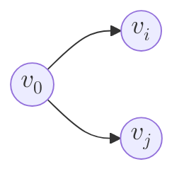
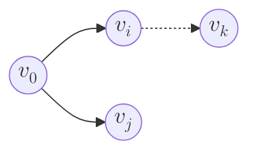
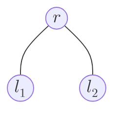
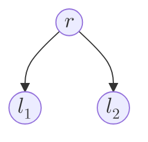
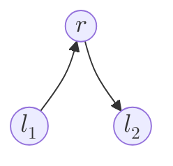
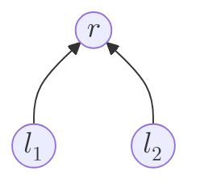
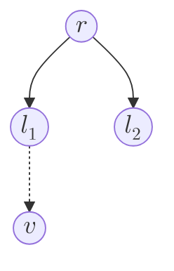

# 0. Vocabulary

- Topological Sort: refers to the result of ordering, i.e. the order
- Topological Sorting: refers to the precedure/algorithm of sorting
- Topological Space: See [Topology / Topological Space](/math/2018/07/16/topological-space)
- Simple Graph: refers to graphs with no loops nor parallel edges. See [Basic Graph Algorithms](/algorithm/2016/01/09/basic-graph-algorithms)
- DAG: _Directed Acyclic Graph_. See [Basic Graph Algorithms](/algorithm/2016/01/09/basic-graph-algorithms)
- Strict Partial Order, Strict Weak Order, Strict Total Order: See [Relation (Math) and Asymptotic Notations](/math/2023/12/18/relation-math-and-asymptotic-notations)

# 1.Digression: What does "topological" mean in topological sorting?

ChatGPT 给我的一个答案是：

> It’s an unfortunate naming overlap. The term “topology” in graph theory means “the layout or structure of connections,” which is different from its meaning in topology as a branch of math.

这个 “the layout or structure of connections” 的意思，按某些网友的说法，应该是 [Network topology](https://en.wikipedia.org/wiki/Network_topology) 的研究领域 (参考 [Why is "topological sorting" topological?](https://cstheory.stackexchange.com/a/30664))

但如果我硬要把 topological sorting 和 topological space 扯上关系呢？也不是不行。实际上，从 graph 可以 induce 出多种类型的 topological spaces，比如：

- 这篇 [Kilicman, Adem, and Khalid Abdulkalek. "Topological spaces associated with simple graphs." Journal of Mathematical Analysis 9.4 (2018): 44-52.](https://portal.arid.my/Publications/2e37b442-9a74-4884-92fd-45319f3ffb6f.pdf) 讲的就是从 simple graph 的 vertex set $V$ 出发构建一个 topological space
- DeepSeek 给我的一个例子是：
    - $\forall v_i, v_j \in V$ such that edge $e = (v_i \to v_j) \in E$, define $(e,t)$ as a point somewhere between $v_i$ and $v_j$ on the edge, where $t \in (0,1)$
        - $t \to 0$ 就是 approaching $v_i$
        - $t \to 1$ 就是 approaching $v_j$
        - 然后你任意的 edge 就可以映射到一个独立的 $[0,1]$ 区间上，这些区间不在一个坐标系内，但 endpoint 是可以重叠的
        - 这么一来，只要有 edge $e = (v_i \to v_j)$，那么在这条 edge 对应的 $[0,1]$ 区间上，就有 $v_i < v_j$
    - $X = V \cup \lbrace (e,t) \mid e \in E, t \in (0,1) \rbrace$ 构成 topological space 的 set
    - topology $\tau$ 太复杂这里就不写了

DeepSeek 这个例子有点绕，但你从它这个角度去理解 topological sort，也不是不行……

我这里讨论这个问题，主要是为了引出 "A graph is naturally a 1-dimensional topological space (sort of)" 这个观点，i.e. graph theory 和 topology space 的研究是可以联动的。

# 2. Is topological sort (on DAG) a relation (math)?

快速回顾一下 topological sort。它其实只要求：

1. Input: $G = (V,E)$
2. Output: A sequence of vertices $s = \overline{v^{(1)} \dots v^{(n)}}$
3. 如果存在 edge $v_i \to v_j$，那么 $v_i$ 一定要排在 $v_j$ 前面，i.e. 必须是 $s = \overline{\dots v_i \dots v_j \dots}$ 这样的形式

## 2.1 DAG Reachability is a Strict Partial Order

我们先考虑这个和 topological sort 相关的 relation: _Reachable_. 

**Definition:** If there is an path $v_i \to \dots \to v_j$, we say $v_j$ is **reachable** from $v_i$, denoted by $v_i \rightsquigarrow v_j$

**Claim:** DAG Reachability is a Strict Partial Order. (Just like strict "subset" $\subset$ relation)

**Proof:**

(✅ Irreflexive) Obviously, $\forall v \in V$, $v \not\rightsquigarrow v$. Otherwise there would be a self loop $v \to \dots \to v$, which contradicts the fact of DAG.

(✅ Asymmetric) Obviously, $\forall v_i, v_j \in V$, $v_i \rightsquigarrow v_j \Rightarrow v_j \not\rightsquigarrow v_i$. Otherwise there would be loop $v_i \rightleftharpoons v_j$, which contradicts the fact of DAG.

(✅ Transitive) Suppose $v_i \rightsquigarrow v_j$ and $v_j \rightsquigarrow v_k$, transitivity holds obviously.

$\blacksquare$

**Claim:** DAG Reachability is NOT a Strict Weak Order.

**Proof:** We reduce the problem to showing that the incomparable relation $\oslash_{\rightsquigarrow}$ is NOT an equivalence relation.

Note that $v_i \oslash_{\rightsquigarrow} v_j \iff v_i \not\rightsquigarrow v_j \wedge v_j \not\rightsquigarrow v_i$, i.e. the two vertices are not connected by any path. E.g.

(✅ Reflexive) Obviously, $\forall v \in V$, $v \oslash_{\rightsquigarrow} v$ (any vertex is not reachable from itself)

(✅ Symmetric) Obviously, $\forall v_i, v_j \in V$, $v_i \oslash_{\rightsquigarrow} v_j \Rightarrow v_j \oslash_{\rightsquigarrow} v_i$ (by definition of $\oslash_{\rightsquigarrow}$)

(❌ Transitive) Suppose $v_i \oslash_{\rightsquigarrow} v_j$ and $v_j \oslash_{\rightsquigarrow} v_k$. It's still possible that there is a $v_i \to \dots \to v_k$ or $v_k \to \dots \to v_i$ path.

$\blacksquare$

**Claim:** DAG Reachability is NOT a Strict Total Order.

**Proof:** We reduce the problem to showing that relation $\rightsquigarrow$ is NOT connected.

(❌ Connected) $\forall v_i, v_j \in V$, it's possible that $v_i \not\rightsquigarrow v_j$ and $v_j \not\rightsquigarrow v_i$, so $\rightsquigarrow$ is NOT connected.

$\blacksquare$

## 2.2 Digression: Visualize the reachability relation to recover the DAG (kind of)

如果 $\forall v_i \rightsquigarrow v_j$, 我们都画一条 edge $v_i \to v_j$，我们最终能得到一个新的 graph $G' = (V, E')$，它不一定就是原来的 $G = (V, E)$，因为它可能有冗余的 edges。这里又引入了一个新的课题：Minimum Equivalent Graph (MEG).

**MEG Problem:** Given a DiGraph, find a smallest subset of $E$ that maintains all reachability relations between vertices.

这个问题我们就不展开了。但 $G'$ 与 $G$ 肯定是能 reduce 到同一个 MEG.

## 2.3 Any FIXED Topological Sort is a Strict Total Order

**我们先不考虑 topological sorting 的不确定性 (即同一个 graph 可能有不同的 topological sort 结果).**

但如果是一个特定的 topological sort，它本质就是个 sequence，所以一定是 Strict Total Order，类似 relation $<$ 和 sequence $1 < 2 < 3 \dots < n$.

证明很直接，我们就略过了。

## 2.4 Topological Sorting is to construct a Linear Extension on DAG Reachability

我找了两个 Linear Extension 的定义，可以对比一下：

**Definition:** Given a partial order $\subseteq$ on a set $X$, a linear extension is total order (a.k.a. linear order) $\leq$ on the same set $X$ such that identity function $I: \subseteq \to \leq$ is order preserving. $\blacksquare$

是不是有点没看懂？我们看下一个：

**Definition:** Given a partial order $\subseteq$ on a set $X$, a linear extension is total order (a.k.a. linear order) $\leq$ on the same set $X$ such that:

1. $\forall a, b \in X$ such that $a \subseteq b$, $a \leq b$
2. $\forall a, b \in X$, either $a \leq b$, or $b \leq a$, or $a = b$

$\blacksquare$

换言之，linear extension on $\subseteq$ 做了两件事：

1. preserving of the old partial order
    - i.e. $\forall (a, b) \in \subseteq$, there must be $(a, b) \in \leq$
    - 我们也称：total order $\leq$ preserves the partial order of $\subseteq$
2. augmentation to the new total order
    - i.e. $\forall (a, b) \in \oslash_{\subseteq}$, we add $(a, b)$ or $(b, a)$ to $\leq$
    - i.e. reduce $\oslash_{\subseteq}$ to empty set $\varnothing$; make $\leq$ **connected**
    - **augmentation 存在 arbitrariness**，即我在 augmentation 的过程中并不 care 到底是 $a \leq b$ 还是 $b \leq a$

**Any FIXED topological sort $\prec$ is a linear extension on DAG Reachability $\rightsquigarrow$**. Augmentation 的 arbitrariness 也正是 topological sorting 结果的不确定性的原因。E.g.

对 $v_i \oslash_{\rightsquigarrow} v_j$，我们可以 augment 成 $v_i \prec v_j$ (i.e. $s = \overline{v_0 v_i v_j}$)，也可以 augment 成  $v_j \prec v_i$ (i.e. $s = \overline{v_0 v_j v_i}$)

Counting the number of linear extensions of a partial order is $\#P$-complete (and well studied).
{: .notice--info}

# 3. How algorithms of DFS & BFS eliminate the arbitrariness

如果我们处理的不是 graph $G$ 而是一棵 tree $T$，那么 DFS & BFS 本质上都是 $T$ 上的 topological sorting。进一步细分：

- topological sorting on $T$
    - DFS
        - pre-order (yields prefix notation)
        - in-order (yields infix notation)
        - post-order (yields postfix notation)
    - BFS == level-order

## 3.1 Pre-order ($\in$ DFS)

假设我们有这么一个简单的 tree $T$:

pre-order 相当于把 $T$ 改造成了 DAG $G_1$:

有 $r \rightsquigarrow l_1$ 和 $r \rightsquigarrow l_2$；对于 $l_1 \oslash_{\rightsquigarrow} v_2$，我们人为选择 augment 成 $l_1 \prec l_2$；最终有 $r \prec l_1 \prec l_2$.

## 3.2 In-order ($\in$ DFS)

in-order 相当于把 $T$ 改造成了 DAG $G$:

我们人为选择了从 $l_1$ 开始而不是从 $l_2$ 开始。这已经是一个 linear order 了，所以 $l_1 \prec r \prec l_2$.

## 3.3 Post-order ($\in$ DFS)

post-order 相当于把 $T$ 改造成了 DAG $G_3$:

有 $l_1 \rightsquigarrow r$ 和 $l_2 \rightsquigarrow r$；对于 $l_1 \oslash_{\rightsquigarrow} v_2$，我们人为选择 augment 成 $l_1 \prec l_2$；最终有 $l_1 \prec l_2 \prec r$.

## 3.4 Level-order (i.e. BFS)

与 pre-order 类似，但对 $l_1$-subtree 和 $l_2$-subtree 的处理有不同。

pre-order 中，我们相当于是人为 augment 了 $\forall v \in l_1\text{-subtree}, v \prec l_2$；同时又因为 $l_1 \prec v$ (by definition of pre-order) 且 $l_1 \prec l_2$ (人为限定)，所以相当于是有:

$$
\text{pre-order} := r \prec l_1 \prec \underbrace{\cdots \, \cdots \, \cdots \, \cdots \, \cdots \, \cdots}_{\text{pre-order of } l_1 \text{-subtree except } l_1} \prec l_2 \prec \underbrace{\cdots \, \cdots \, \cdots \, \cdots \, \cdots \, \cdots}_{\text{pre-order of } l_2 \text{-subtree except } l_2}
$$

level-order 中，我们同样人为 augment 了 $l_1 \prec l_2$；但 more generally，我们限定了：

1. $\forall v_k^{(1)}, \dots v_k^{(2^{k-1})} \in \text{vertices on level } k$，按从左至右排成 $v_k^{(1)} \prec \dots \prec v_k^{(2^{k-1})}$
2. $\forall v_k \text{ on level } k$ and $\forall v_x \text{ on level } x$, if $k < x$, then $v_k \prec v_x$ 

于是最后的结果是：

$$
\text{level-order} := r \prec \underbrace{l_1 \quad \prec \quad l_2}_{\text{level-order of level } 2} \prec \underbrace{\cdots \, \cdots \, \cdots \, \cdots}_{\text{level-order of level } 3} \prec \underbrace{\cdots \, \cdots \, \cdots \, \cdots}_{\text{level-order of level } 4} \prec \dots
$$