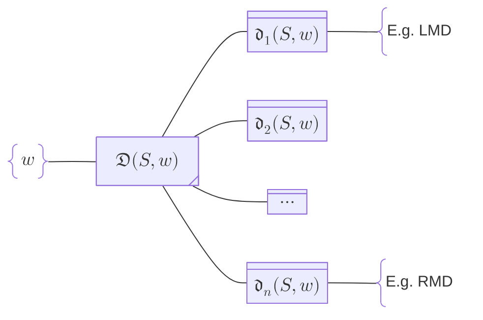
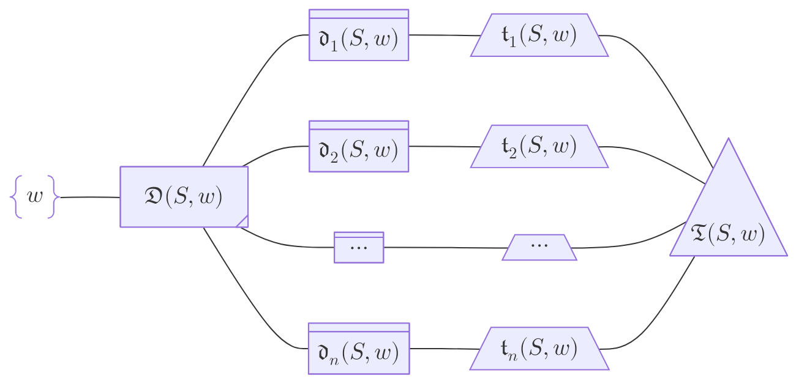
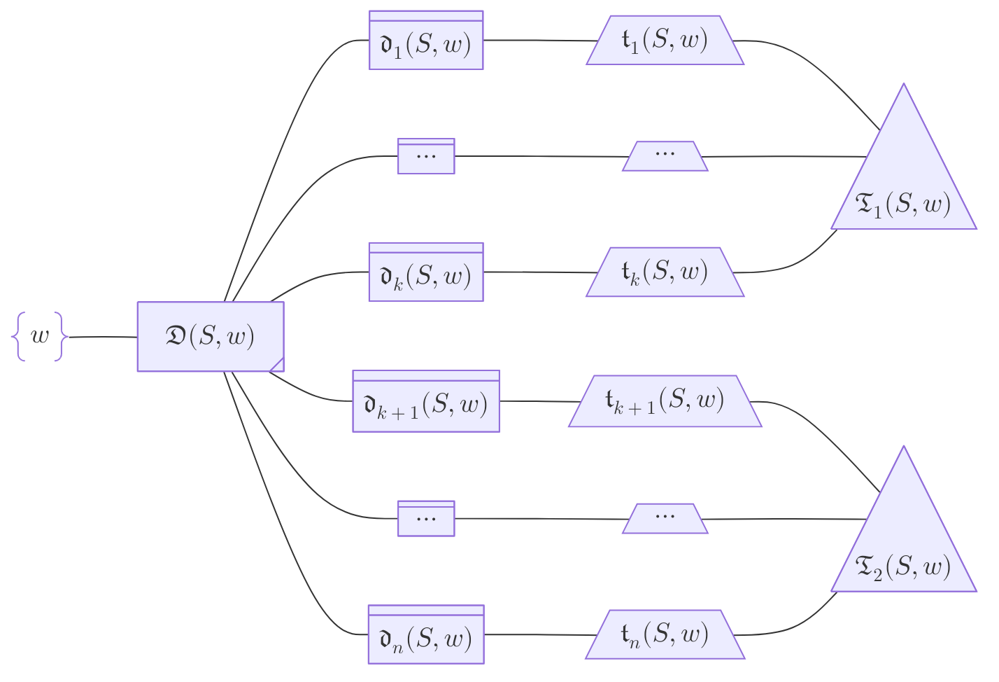
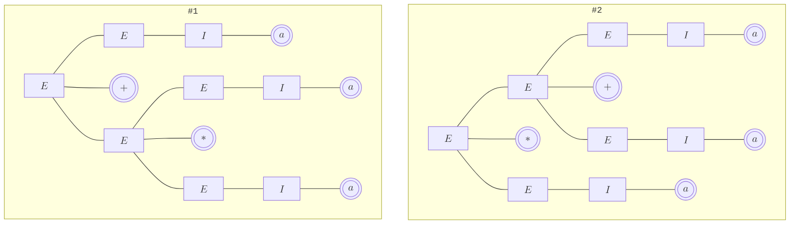
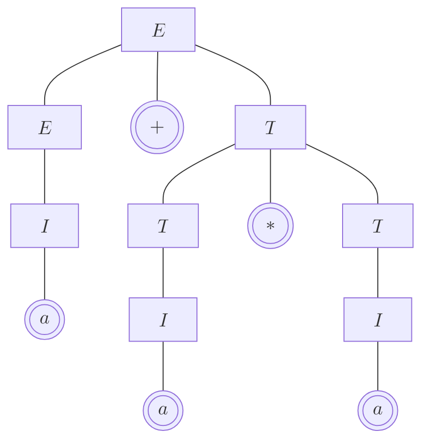

# Parse Tree

## Definition

<div class="notice--info" markdown="1">
**Derivation Tree is a better name**

Parse Tree 的另一个名字 -- Derivation Tree -- 明显是一个更好的名字，因为这样一来我们就很能自然地把 derivation 和 tree 联系起来。

我们在 parsing 的时候，parse tree 一般都是 $S \overset{\ast}{\Rightarrow} w$ where $w$ is a sentence 的情形；但更 general 的 $A \overset{\ast}{\Rightarrow} w'$ where $w'$ is a sentential form 的情况，我们构建的 tree 也算是 parse tree。换句话说，不要把 parse tree 限定成 $S \overset{\ast}{\Rightarrow} w$ 这么一种形式。
</div>

**Characteristics:** For CFG $G = (V,T,P,S)$, a parse tree (or derivation tree) of $G$ is a tree satisfying the following conditions:

1. Every interior/internal node is labeled by a non-terminal $A \in V$
2. Every leaf node is labeled by $x$ which is either a terminal, a terminal, or $\varepsilon$, i.e. $x \in V \cup T \cup \lbrace \varepsilon \rbrace$
    - A leaf labeled by $\varepsilon$ must be the only child of its parent.
3. If an internal node is labeled by $A$ with children labeled by (from left to right) $X_1, X_2, \dots, X_n$，then $A \rightarrow X_1X_2 \dots X_n$ must be a production $\in P$.
    - Or it represents the application of production $A \rightarrow X_1X_2 \dots X_n$ in the corresponding derivation.

**Definition:** **Yield (产物) or frontier** of a parse tree is the concatenated string of leaf labels (left–right).

## Derivation $\iff$ Parse Tree $\mid$ Sentential Form $\iff$ Yield

**Theorem:** CFG $G$ has a derivation $A \overset{*}{\Rightarrow} \alpha$ $\iff$ $\exists$ a parse tree with root labeled $A$ and a yield of $\alpha$. $\blacksquare$

**Proof:** ($\Rightarrow$) Proof by induction on the number of steps $k$ in the derivation $A \overset{k}{\Rightarrow} \alpha$. 

Base Case: $k=1$. If $A \to \alpha_1 \alpha_2 \dots \alpha_n$, then $\exists$ a parse tree with height 1:


Induction Step: suppose the assumption holds for all $\leq k$-step derivation $A \overset{\leq k}{\Rightarrow} \beta$.

For $k+1$-step derivation $A \overset{k}{\Rightarrow} \beta \Rightarrow \alpha$, there $\exists$ a parse tree with height $k$, root labeled $A$, and a yield of $\beta$.

There must be a non-terminal $X$ in $\beta$ and a production $X \to \gamma$, who together derive $\beta \Rightarrow \alpha$ . We can add $X \to \gamma$ to the above parse tree. The new tree is valid.


($\Leftarrow$) Proof by induction on the number of internal nodes $k$ of the parse tree.

Base Case: If the parse tree has only $1$ internal node, then it must be the root, and the height of the parse tree must be $1$. This means $A \to \alpha_1 \alpha_2 \dots \alpha_n$ must be a production, and the derivation holds.


Induction Step:  suppose the assumption holds for all parse tree with $\leq k$ internal nodes.

Now if we have a parse tree with $k+1$ internal nodes 的 parse tree like this:


- It's certain that the parse tree for $A \Rightarrow X_1 X_2 \dots X_n$ has $\leq k$ internal nodes
- Similarly the parse tree for $\forall X_i \Rightarrow \alpha_i$ has $\leq k$ internal nodes

Therefore there exist derivation $A \overset{\ast}{\Rightarrow} X_1 X_2 \dots X_n$ and $\forall i, X_i \overset{\ast}{\Rightarrow} \alpha_i$, and the combined derivation $A \overset{\ast}{\Rightarrow} \alpha_1 \alpha_2 \dots \alpha_n$ holds. $\blacksquare$

<div class="notice--info" markdown="1">
这个定理再结合 "任何 derivation 都有等价的 leftmost derivation 和 rightmost derivation"，我们可以认为意下 5 个命题等价：

1. $w \in L(A)$，或者说 $w$ 是一个 sentential form (derived from $A$)
2. $\exists$ parse tree 以 $A$ 为 root 且 yield 为 $w$
3. $A \overset{*}{\Rightarrow} w$
4. $A \overset{*}{\underset{\text{lm}}{\Rightarrow}} w$
5. $A \overset{*}{\underset{\text{rm}}{\Rightarrow}} w$
</div>

# Ambiguity

## Definition

**Definition:** A grammar $G = (V,T,P,S)$ is said to be **ambiguous (歧义的)** if $\exists w \in L(G)$ for which derivation $S \overset{*}{\Rightarrow} w$ two different parse trees.

“判定任意给定的 CFG $G$ 是否歧义” 是一个不可判定问题。
{: .notice--info}

**Definition:** Given a language $L$, if every CFG of $L$ is ambiguous, then $L$ is **inherently ambiguous (固有歧义)**

<div class="notice--info" markdown="1">
Example: $L=\lbrace a^ib^jc^k \mid i=j \text{ or } j=k \rbrace$ 

$L$ 中任何形为 $a^nb^nc^n$ 的串，总会有两棵 parse tree，所以 $L$ 是固有歧义的
</div>

## Sentential Form 与 Derivation 与 Parse Tree 的数量关系

我们先区分一下 derivation:

- 我们把 $S \overset{\ast}{\Rightarrow} w$ 这样省略了中间步骤的 derivation 称为 abstract derivation，用 $\mathfrak{D}(S,w)$ 表示
- 我们把 $S \Rightarrow \dots \Rightarrow w$ 这样列出了中间每一步的 derivation 称为 concrete derivation，用 $\mathfrak{d}_i(S,w)$
- abstract derivation 的本质是 a set of concrete derivations, i.e. $\mathfrak{D}(S,w) = \lbrace \mathfrak{d}_1(S,w), \mathfrak{d}_2(S,w), \dots, \mathfrak{d}_n(S,w) \rbrace$

同时，考虑到：

- An abstract derivation cannot reveal the order of production application, just like a parse tree cannot reveal the order of its node expansion/creation.
- A concrete derivation shows a fixed order of production application, while a [topological sort](/math/2025/06/12/topological-sorting-linear-extension) of a parse tree is also a fix order of its node expansion/creation.

我们也区分一下 "parse tree" 和 "parse tree 上的 topological sort":

- 我们用 $\mathfrak{T}(S,w)$ 表示一棵具体的 parse tree
- 我们用 $\mathfrak{t}_i(S,w)$ 表示 $\mathfrak{T}(S,w)$ 上的一个 topological sort

**考虑 Sentential Form 与 Derivation 的关系时不需要考虑 grammar $G$ 的 ambiguity**，因为一个 sentential form $w$ 一定只可能有一个 abstract derivation，且一定可以有多个 concrete derivation，无论 $G$ 是否 ambiguous:



**考虑 Derivation 与 Parse Tree 的数量关系时需要考量 grammar $G$ 的 ambiguity.**

When $G$ is unambiguous:



When $G$ is ambiguous (suppose there are 2 parse trees for the abstract derivation below):



## Ambiguous Grammar Example #1: arithmetic operator precedence

假设我们有这么个语法：

$$
\begin{aligned}
E &\rightarrow E + E \mid E * E \mid I \newline
I &\rightarrow a
\end{aligned}
$$

这个语法对句型 $a + a * a$ 就是歧义的（体现为运算优先级的不同）



## Ambiguous Grammar Example #2: dangling ELSE problem

假设我们有这么个语法：

$$
\begin{aligned}
\langle stmt \rangle \rightarrow & \; \text{if } \langle expr \rangle \text{ then } \langle stmt \rangle \newline
     \mid & \; \text{if } \langle expr \rangle \text{ then } \langle stmt \rangle \text{ else } \langle stmt \rangle \newline
     \mid & \; \langle other\_stmt \rangle
\end{aligned}
$$

那么句子 $w = \text{if } E_1 \text{ then if } E_2 \text{ then } S_1 \text{ else } S_2$ 就是歧义的。

用 python 更好理解一些：

```python
# Block #1
if E1:
    if E2:
        S1
    else:
        S2

# Block #2
if E1:
    if E2:
        S1
else:
    S2
```

换言之就是以下二式的区别：

$$
\begin{aligned}
w &= \text{if } E_1 \text{ then } \underbrace{\text{if } E_2 \text{ then } S_1 \, \text{else } S_2}_{\langle stmt \rangle} \newline
w &= \text{if } E_1 \text{ then } \underbrace{\text{if } E_2 \text{ then } S_1}_{\langle stmt \rangle} \, \text{else } \underbrace{S_2}_{\langle stmt \rangle}
\end{aligned}
$$

你写成 python 有 indent 保证，但是输入给 parser 的时候往往是 $\text{if } E_1 \text{ then if } E_2 \text{ then } \dots$ 这种 flattened 的形式。

# Disambiguation

## Method #1: Rewrite the Grammar

**有些文法的歧义性，可以通过重新设计文法来消除**。

比如 [Example #1](#ambiguous-grammar-example-1-arithmetic-operator-precedence) 的文法可以修改为：

$$
\begin{aligned}
E &\rightarrow E + T \mid T \mid I \newline
T &\rightarrow T * T \mid I \newline
I &\rightarrow a
\end{aligned}
$$



比如 [Example #2](#ambiguous-grammar-example-2-dangling-else-problem) 的文法可以修改为：

$$
\begin{aligned}
\langle stmt \rangle \rightarrow & \; \langle matched\_stmt \rangle \newline
     \mid & \; \langle unmatched\_stmt \rangle \newline
\langle matched\_stmt \rangle \rightarrow & \; \text{if } \langle expr \rangle \text{ then } \langle matched\_stmt \rangle \text{ else } \langle matched\_stmt \rangle \newline
     \mid & \; \langle other\_stmt \rangle \newline
\langle unmatched\_stmt \rangle \rightarrow & \; \text{if } \langle expr \rangle \text{ then } \langle stmt \rangle \newline
     \mid & \; \text{if } \langle expr \rangle \text{ then } \langle matched\_stmt \rangle \text{ else } \langle unmatched\_stmt \rangle \newline
\end{aligned}
$$

## Method #2: Syntactic Predicates / Alternative Precedence

指像 ANTLR 之类的有 special instructions 或者 rules 可以指定优先匹配哪个 alternative production.

比如 ANTLR 有 "First Written, Fist Match" 原则 (i.e. greedy choice)，比如：

```antlr4
expr: expr '+' expr   # Add
    | expr '*' expr   # Mul
    | INT             # Int
    ;

INT: [0-9]+;
```

当输入为 `INT + INT * INT` 时，因为 `expr '+' expr` 写在 `expr '*' expr` 前面，所以 `expr '+' expr` 的优先级更高，于是会优先匹配 `INT + INT`.