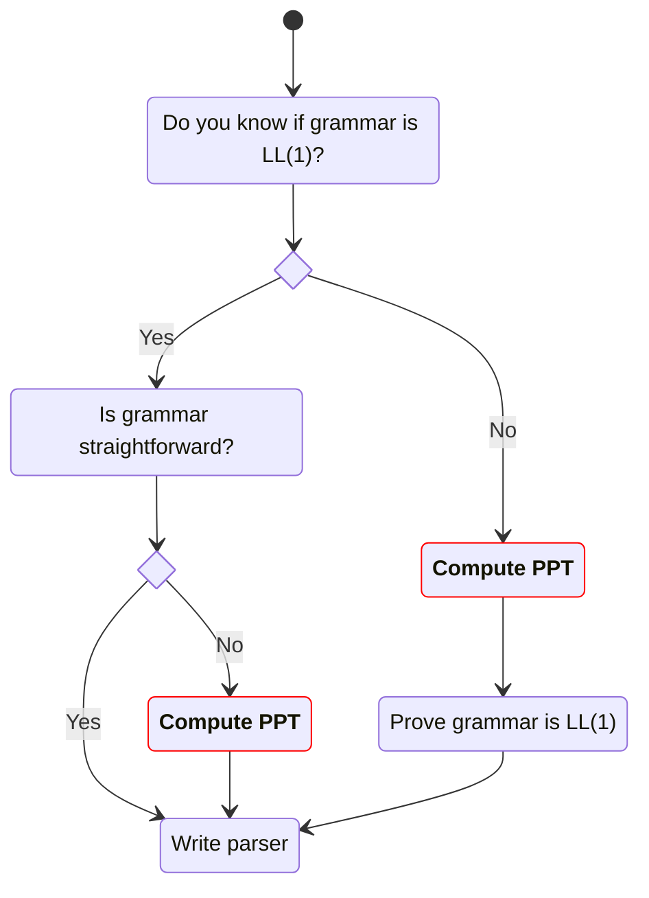

# 0. Vocabulary

In this post we use the following abbreviation, symbols, and operators:

- $A \uplus B$ means $A := A \cup B$ for two sets $A,B$
- Grammar $G = (V, \Sigma, S, P)$
- $\Phi$ is a map of $\alpha \mapsto \operatorname{FIRST}(\alpha)$ where $\alpha$ could be:
    - a single terminal $a \in \Sigma$
    - a single variable $X \in V$
    - an RHS sequence as in any production $(X \to \alpha) \in P$
- $\Lambda$ is a map of $X \mapsto \operatorname{FOLLOW}(X)$ where $X \in V$
- PPT stands for _Predictive Parsing Table_

# 1. If you know your grammar is $LL(1)$

Our logic should follow this state diagram on writing an $LL(1)$ parser:



Let’s start with the easy case: suppose you already know your grammar is $LL(1)$. 

If your grammar is simple or straightforward, you can write the parser directly by looking at the productions. E.g.:

```g4
S : 'a' X ;
  | 'b' Y ;
```

The parser is like:

```python
def S():
    if lookahead() == 'a':
        match('a')
        X()
    elif lookahead() == 'b':
        match('b')
        Y()
    else:
        raise error()
```

If your grammar is not so straightforward, like:

```g4
S : AX ;
  | BY ;
A : CD ;
B : EF ;
...
```

then you need PPT since you cannot infer when to match `A` or when to match `B` simply from the lookahead and productions.

```python
def S():
    if lookahead() == ???:
        A()
        X()
    elif lookahead() == ???:
        B()
        Y()
    else:
        raise error()
```

# 2. If you don't know if your grammar is $LL(1)$

But what if you're not sure whether your grammar is $LL(1)$? Before writing a parser, you’ll need to verify that your grammar satisfies the $LL(1)$ condition.

The verification can also be done with a PPT.

# 3. How to compute PPT

In 2 out of the 3 cases we listed above, we need to compute PPT. It needs do some groundwork,  specifically, the $\operatorname{FIRST}$ and $\operatorname{FOLLOW}$ sets.

## 3.1 $\operatorname{FIRST}$ Set

### 3.1.1 Definitions

**Definition:** Given CFG $G = (V,\Sigma,P,S)$ and a sequence of symbols $\alpha \in (V \cup \Sigma)^*$, the $\operatorname{FIRST}$ set of $\alpha$ is the set of terminals that begin the sentential forms derivable from $\alpha$. Plus, if $\alpha$ can derive $\varepsilon$, then $\varepsilon \in \operatorname{FIRST}(\alpha)$. $\blacksquare$

**Definition:** If we only consider single symbols $X \in V \cup \Sigma$, we can define:

$$
\operatorname{FIRST}(X) = \begin{cases}
\lbrace X \rbrace &\text{if } X \in \Sigma \newline
\big \lbrace x \mid (X \overset{*}{\Rightarrow} x \beta \text{, } x \in \Sigma \text{, } \beta \in (V \cup \Sigma)^*) \big \rbrace &\text{if } X \in V \text{ and } X \not\overset{\ast}{\Rightarrow} \varepsilon \newline
\big \lbrace x \mid (X \overset{*}{\Rightarrow} x \beta \text{, } x \in \Sigma \text{, } \beta \in (V \cup \Sigma)^*) \big \rbrace \cup \lbrace \varepsilon \rbrace & \text{if } X \in V \text{ and } X \overset{\ast}{\Rightarrow} \varepsilon 
\end{cases}
$$

$\operatorname{FIRST}$ sets on $\alpha \in (V \cup \Sigma)^*$ is similar to the cases of $X \in V$.

$\blacksquare$

<div class="notice--info" markdown="1">
**Nullable property and $\operatorname{Derives-\varepsilon}$ function**

Some textbooks define a property called **nullable** as:

$$
\alpha \overset{*}{\Rightarrow} \varepsilon \iff \alpha \text{ is nullable}
$$

$\blacksquare$

while some other define a $\operatorname{Derives-\varepsilon}$ function for the same purpose:

$$
\alpha \overset{*}{\Rightarrow} \varepsilon \iff \operatorname{Derives-\varepsilon}(\alpha) =  \text{True}
$$

$\blacksquare$
 
Some textbooks also prefer excluding $\varepsilon$ from the definition of $\operatorname{FIRST}(\alpha)$.
</div>

<div class="notice--info" markdown="1">
If $\alpha = Y_1 Y_2 \dots Y_k$, these statements are equivalent:

1. $Y_1 Y_2 \dots Y_k \overset{*}{\Rightarrow} \varepsilon$
2. $Y_1 Y_2 \dots Y_k \text{ is nullable}$
3. $\operatorname{Derives-\varepsilon}(Y_1 Y_2 \dots Y_k) = \text{True}$
4. $\varepsilon \in L(Y_1 Y_2 \dots Y_k)$
5. $\varepsilon \in \operatorname{FIRST}(Y_1 Y_2 \dots Y_k)$
6. $\varepsilon \in \operatorname{FIRST}(Y_1) \cap \operatorname{FIRST}(Y_2) \cap \dots \cap \operatorname{FIRST}(Y_k) = \bigcap_{i=0}^{k} \operatorname{FIRST}(Y_i)$
</div>

### 3.1.2 Pilot Algorithm: computing $\operatorname{FIRST}$ set for a single symbol, when other $\operatorname{FIRST}$ sets are known {#312-pilot-algorithm}

We can use the following algorithm:

$$
\begin{align}
&\textbf{global } \Phi = \text{ a map of known } \operatorname{FIRST} \text{ sets except } X \text{'s} \nonumber \qquad \newline
&\textbf{procedure } \mathrm{compute\_first\_set\_for\_symbol}(\forall X \in V \cup \Sigma) \text{: } \nonumber \qquad \newline  
& \qquad \text{if } X \in \Sigma \text{: } \tag{1} \qquad \newline  
& \qquad\qquad \text{return } \lbrace X \rbrace \tag{2} \qquad \newline
& \newline

& \qquad \text{// if } X \in V \text{: } \qquad \newline 
& \qquad \Phi[X] = \lbrace \varepsilon \rbrace \text{ if } \exists \big(X \to \varepsilon \big) \in P \text{ else } \lbrace \rbrace \qquad \newline 

& \qquad \text{for each } \big( X \rightarrow Y_1 Y_2 \dots Y_k \big) \in P\text{: } \qquad \newline  
& \qquad\qquad \text{for } i = 1 \text{ to } k \text{: } \qquad \newline

& \qquad\qquad\qquad \Phi[X] \uplus \big( \Phi[Y_i] \setminus \lbrace\varepsilon\rbrace \big) \qquad \newline 
& \qquad\qquad\qquad \text{if } \varepsilon \not\in \Phi[Y_i] \text{: } \qquad \newline 
& \qquad\qquad\qquad\qquad \text{break } \qquad \newline 
& \qquad\qquad \text{else: } \qquad \newline
& \qquad\qquad\qquad \text{/* } \qquad \newline
& \qquad\qquad\qquad \quad \text{This else-clause executes only if the loop } \qquad \newline
& \qquad\qquad\qquad \quad \text{terminates normally without breaking, } \qquad \newline
& \qquad\qquad\qquad \quad \text{meaning every } Y_i \text{ is nullable. } \qquad \newline
& \qquad\qquad\qquad \text{*/ } \qquad \newline
& \qquad\qquad\qquad \Phi[X] \uplus \lbrace\varepsilon\rbrace \qquad \newline
& \qquad \text{return } \Phi[X]
\end{align}
$$

where:

- [`for-else` works like in Python](/python/2017/09/28/python-for-else-with-break)
- If $\exists Y_i \in \Sigma$, then the inner `for` loop breaks, and $\varepsilon \not\in \Phi[X]$
- You can also initialize $\Phi$ to contain all $\Phi[a] = \lbrace a \rbrace, \forall a \in \Sigma$ so Line (1) and (2) can be removed

If you have a grammar without any $\varepsilon$-production, this algorithm becomes way simpler:

$$
\begin{align}
&\textbf{global } \Phi = \text{ a map of known } \operatorname{FIRST} \text{ sets except } X \text{'s} \nonumber \qquad \newline
&\textbf{procedure } \mathrm{compute\_first\_set\_for\_symbol}(\forall X \in V \cup \Sigma) \text{: } \nonumber \qquad \newline  
& \qquad \text{if } X \in \Sigma \text{: } \qquad \newline  
& \qquad\qquad \text{return } \lbrace X \rbrace \qquad \newline
& \newline

& \qquad \text{// if } X \in V \text{: } \qquad \newline
& \qquad \Phi[X] = \lbrace \rbrace \qquad \newline
& \qquad \text{for each } \big( X \rightarrow Y_1 Y_2 \dots Y_k \big) \in P\text{: } \qquad \newline  
& \qquad\qquad \Phi[X] \uplus \Phi[Y_1] \qquad \newline 

& \qquad \text{return } \Phi[X]
\end{align}
$$

However in real world, [$\varepsilon$-production are not always elimimated](/compiler/2025/06/24/appetizers-before-parsing-serving-order).

### 3.1.3 Algorithm: computing $\operatorname{FIRST}$ sets for all symbols

Now we want to compute all $\operatorname{FIRST}$ sets at the grammar level with a single function. 

#### 3.1.3.1 A Flawed Intuition

An intuition is to call `compute_first_set_for_symbol`$(S, \Phi = \lbrace \rbrace)$ with modification: if $\Phi[Y_i]$ is unknow, recursively call `compute_first_set_for_symbol`$(Y_i, \Phi)$.

This intuition has a big flaw: it cannot handle circular dependencies. Note that:

1. Circular dependencies means endless recurisive calls
2. [We usually elimiates Left Recursion beforehand](/compiler/2025/06/23/appetizer-3-before-parsing-eliminating-left-recursions) but it is only a special form of circular dependencies

Some circular dependencies are direct and obvious, like:

```g4
A -> B a
B -> A b | c
```

Some are involved with "skip-ahead" and less obvious, like:

```g4
A -> B C a
B -> ε | d
C -> A e | f
```

where $\Phi[A]$ depends on $\Phi[B]$ and $\Phi[C]$ (because $B$ is nullable), and $\Phi[C]$ depends on $\Phi[A]$. Therefore `compute_first_set_for_symbol`$(A, \cdot)$ will end up calling itself.

#### 3.1.3.2 Fixed-Point Approach

How it works:

1. Go through every production, compute every $\Phi(X)$ where $X$ is the LHS of the production
2. Repeat until $\Phi$ is not changed anymore

$$
\begin{align}
&\textbf{global } \Phi = \big \lbrace x \mapsto \lbrace x \rbrace \mid x \in \Sigma \big \rbrace \qquad \newline
&\qquad \quad \; \Phi \uplus \big \lbrace X \mapsto \eta \mid X \in V, \eta = \lbrace \varepsilon \rbrace \text{ if } \exists \big(X \to \varepsilon \big) \in P \text{ else } \lbrace \rbrace \big \rbrace \qquad \newline

&\textbf{procedure } \mathrm{compute\_first\_sets\_for\_V}() \text{: } \nonumber \qquad \newline  

& \qquad \text{repeat until } \Phi \text{ is not changed} \text{: }\qquad \newline  

& \qquad\qquad \text{for each } \big( X \rightarrow Y_1 Y_2 \dots Y_k \big) \in P\text{: } \qquad \newline  
& \qquad\qquad\qquad \text{for } i = 1 \text{ to } k \text{: } \qquad \newline
& \qquad\qquad\qquad\qquad \Phi[X] \uplus \big( \Phi[Y_i] \setminus \lbrace\varepsilon\rbrace \big) \qquad \newline 
& \qquad\qquad\qquad\qquad \text{if } \varepsilon \not\in \Phi[Y_i] \text{: } \qquad \newline 
& \qquad\qquad\qquad\qquad\qquad \text{break } \qquad \newline 
& \qquad\qquad\qquad \text{else: } \qquad \newline
& \qquad\qquad\qquad\qquad \text{/* } \qquad \newline
& \qquad\qquad\qquad\qquad\quad \text{This else-clause executes only if the loop } \qquad \newline
& \qquad\qquad\qquad\qquad\quad \text{terminates normally without breaking, } \qquad \newline
& \qquad\qquad\qquad\qquad\quad \text{meaning every } Y_i \text{ is nullable. } \qquad \newline
& \qquad\qquad\qquad\qquad \text{*/ } \qquad \newline
& \qquad\qquad\qquad\qquad \Phi[X] \uplus \lbrace\varepsilon\rbrace \qquad \newline
& \qquad \text{return } \Phi
\end{align}
$$

This approach cannot eliminate circular dependencies, but terimiates in time when the fixed-point is reached.

### 3.1.4 Algorithm: computing $\operatorname{FIRST}$ set for any RHS sequence

To construct PPT, we need $\Phi[\alpha]$ for each RHS $\alpha$ appearing in a production. The algorithm is similar to [Section 3.1.3.2](#3132-fixed-point-approach):

$$
\begin{align}
&\textbf{global } \Phi = \mathrm{compute\_first\_sets\_for\_V}() \qquad \newline

&\textbf{procedure } \mathrm{compute\_first\_set\_for\_RHS}(\alpha = Y_1 Y_2 \dots Y_k) \text{: } \nonumber \qquad \newline  

& \qquad \text{for } i = 1 \text{ to } k \text{: } \qquad \newline
& \qquad\qquad \Phi[\alpha] \uplus \big( \Phi[Y_i] \setminus \lbrace\varepsilon\rbrace \big) \qquad \newline 
& \qquad\qquad \text{if } \varepsilon \not\in \Phi[Y_i] \text{: } \qquad \newline 
& \qquad\qquad\qquad \text{break } \qquad \newline 
& \qquad \text{else: } \qquad \newline
& \qquad\qquad \text{/* } \qquad \newline
& \qquad\qquad\qquad \text{This else-clause executes only if the loop } \qquad \newline
& \qquad\qquad\qquad \text{terminates normally without breaking, } \qquad \newline
& \qquad\qquad\qquad \text{meaning every } Y_i \text{ is nullable. } \qquad \newline
& \qquad\qquad \text{*/ } \qquad \newline
& \qquad\qquad \Phi[\alpha] \uplus \lbrace\varepsilon\rbrace \qquad \newline
& \qquad \text{return } \Phi[\alpha]
\end{align}
$$

## 3.2 $\operatorname{FOLLOW}$ Set

**Definition:** Given CFG $G = (V,\Sigma,P,S)$ and a single variable $A \in V$, the $\operatorname{FOLLOW}$ set of $A$ is the set of terminals that can appear immediately to the right of $A$ in some sentential form. Plus, if $A$ is the rightmost symbol in some sentential form, then the EOF symbol $\Finv \in \operatorname{FOLLOW}(A)$. 

I.e. $\forall A \in V$

$$
\operatorname{FOLLOW}(A) = \big \lbrace t \mid (S \overset{+}{\Rightarrow} \alpha A t\beta \text{, } t \in \Sigma ) \text{ or } (S \overset{*}{\Rightarrow} \alpha A \text{, } t = \Finv) \big \rbrace . 
$$

$\blacksquare$

We can follow the fixed-point strategy of [Section 3.1.3.2](#3132-fixed-point-approach) and implement a single function to compute all $\operatorname{FOLLOW}$ sets at once at the grammar level.

We need pre-computed collection $\Phi$ of $\operatorname{FIRST}$ sets in the computation, and we initialize the collection $\Lambda$ of $\operatorname{FOLLOW}$ sets as: $\Lambda[S] = \lbrace \Finv \rbrace$ since we always have $S \overset{\ast}{\Rightarrow} S \Finv$. 

Note that always $\varepsilon \not\in \operatorname{FOLLOW}(\cdot)$
{: .notice--warning}

The algorithm is shown below:

$$
\begin{align}

&\textbf{global } \Phi = \mathrm{compute\_first\_sets\_for\_V}() \qquad \newline
&\textbf{global } \Lambda = \big \lbrace S \mapsto \lbrace \Finv \rbrace \big \rbrace \cup \big \lbrace X \mapsto \lbrace \rbrace \mid X \in V, X \neq S\big \rbrace \qquad \newline

&\textbf{procedure } \mathrm{compute\_follow\_sets\_for\_V}() \text{: } \nonumber \qquad \newline  
& \qquad \text{repeat until } \Lambda \text{ is not changed} \text{: }\qquad \newline 
& \qquad\qquad\text{for each } (Y \rightarrow \alpha X) \in P \text{: } \qquad \newline  
& \qquad\qquad\qquad \Lambda[X] \uplus \Lambda[Y] \tag{1} \qquad \newline 
& \qquad\qquad\text{for each } (Y \rightarrow \alpha X \beta) \in P \text{: } \qquad \newline 
& \qquad\qquad\qquad \Lambda[X] \uplus \big( \Phi[\beta] \setminus \lbrace\varepsilon\rbrace \big) \tag{2} \qquad \newline 
& \qquad\qquad\qquad \text{if } \varepsilon \in \Phi[\beta] \text{: } \tag{3} \qquad \newline 
& \qquad\qquad\qquad\qquad \Lambda[X] \uplus \Lambda[Y] \tag{4} \qquad \newline 
& \qquad \text{return } \Lambda
\end{align}
$$

Explanation:

- Line (1): if $b \in \Lambda[Y]$, then string $Yy$ appears in some sentential form. Apply the production $Y \to \alpha X$, and string $\alpha X b$ appears in the corresponding sentential form. Therefore $b \in \Lambda[X]$
- Line (2)(3)(4):
    - If $\varepsilon \in \Phi[\beta]$, logic falls back to Line (1)
    - If $b \in \Phi[\beta]$, then $\beta \overset{\ast}{\Rightarrow} b\dots$, which means $Y \overset{\ast}{\Rightarrow} \alpha X b\dots$. Plus $Y$ [should be reachable](/compiler/2025/06/21/appetizer-1-before-parsing-cfg-simplification) from $S$, therefore there should be a sentential form $S \overset{\ast}{\Rightarrow} \dots Y \dots \overset{\ast}{\Rightarrow} \dots \alpha X b\dots$, and in the end $b \in \Lambda[X]$

<div class="notice" markdown="1">
Note the directions of $X$ and $Y$ in the two algorithms:

- $\operatorname{FIRST}$ sets: find production like $X \to Y_1 \dots Y_k$, update $\Phi[X] \uplus \Phi[Y_i]$
- $\operatorname{FOLLOW}$ sets: find production like $Y \to \dots X \dots$, update $\Lambda[X] \uplus \Lambda[Y]$
</div>

## 3.3 Construct PPT from $\operatorname{FIRST}$ and $\operatorname{FOLLOW}$ Sets

PPT $T$ is a table whose row-index is $V$, column-index is $\Sigma$, and each cell is a production $\in P$.

$$
\begin{align}

&\textbf{global } \Phi = \big \lbrace \mathrm{\alpha \mapsto compute\_first\_set\_for\_RHS}(\alpha) \mid (X \to \alpha) \in P \big \rbrace \qquad \newline

&\textbf{global } \Lambda = \mathrm{compute\_follow\_sets\_for\_V}() \qquad \newline

&\textbf{procedure } \mathrm{construct\_PPT}() \text{: } \nonumber \qquad \newline  
& \qquad \text{init } T \text{ as an empty } \vert V \vert \times \vert \Sigma \vert \text{ table} \text{: }\qquad \newline 
& \qquad \text{for each } (X \to \alpha) \in P \text{: } \qquad \newline  
& \qquad\qquad\text{for each terminal } p \in \Phi[\alpha] \text{: } \qquad \newline 
& \qquad\qquad\qquad T[X,p] = (X \to \alpha) \qquad \newline 
& \qquad\qquad\qquad \text{if } \varepsilon \in \Phi[\alpha] \text{: } \tag{1} \qquad \newline 
& \qquad\qquad\qquad\qquad \text{for each terminal } q \in \Lambda[X] \text{: } \tag{2} \qquad \newline 
& \qquad\qquad\qquad\qquad\qquad T[X,q] = (X \to \alpha) \tag{3} \qquad \newline  
& \qquad \text{return } T
\end{align}
$$

If you have a grammar without any $\varepsilon$-production, the whole thing becomes way simpler:

1. All the three algorithms on $\operatorname{FIRST}$ sets are way simpler
    - See [Section 3.1.2](#312-pilot-algorithm) as an example
2. No need to compute $\operatorname{FOLLOW}$ sets at all!
3. Line (1)(2)(3) in above algorithm can be removed

Howeve as we mentioned in [Section 3.1.2](#312-pilot-algorithm), in real world, [$\varepsilon$-production are not always elimimated](/compiler/2025/06/24/appetizers-before-parsing-serving-order).

## 3.4 Prove your grammar is $LL(1)$

**Corollary:** $G$ is a $LL(1)$ grammar $\iff$ $T$ is conflict-free $\iff$ There is at most 1 production in any cell of $T$

# 4. Write your $LL(1)$ parser

Just follow the script skeleton in [Section 1](#1-if-you-know-your-grammar-is).

A reference implementation is [MyTeenyTinyCompiler/parse.py](https://github.com/erikyao/MyTeenyTinyCompiler/blob/main/parse.py), which is inspired by [Let's make a Teeny Tiny compiler](https://austinhenley.com/blog/teenytinycompiler1.html) by [Austin Z. Henley](https://austinhenley.com/blog.html).

Other top-down parser implementation techniques can be found in [Top-Down Parsers: Recursive Descent, Predictive, and More](/compiler/2025/06/26/top-down-parsers-recursive-descent-predictive-and-more).