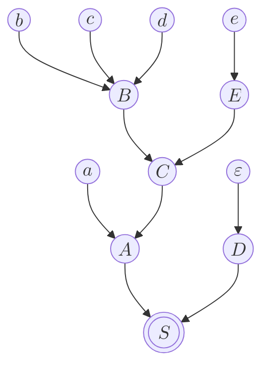
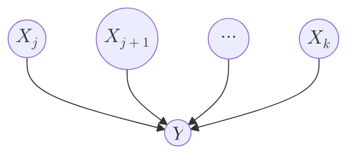

# Clue 1️⃣: Reduction to Root == Pruning off Handles

Knuth 写于 1965 年的里程碑著作 [On the Translation of Languages from Left to Right](https://www.sciencedirect.com/science/article/pii/S0019995865904262) 提供了一个非常好的 intuition：假设你已经有了一个 parse tree，你把它倒过来，那么 parsing 的过程就是从 leaves 开始一路 reduce 到 root 的过程。 

比如这么一个语法：

```bnf
S -> AD
A -> aC
B -> bcd
C -> BE
D -> ε
E -> e
```

然后我们针对 $w = abcde$ 有这么一个 parse tree；



可以看出：

- 我们一定是先 reduce $bcd \rhd B$，可以想象成把 $b,c,d$ 三个 leaves 全部 prune 掉
- 然后 reduce $e \rhd E$，可以想像成把 $e$ 这个 leaf 给 prune 掉
- 你一定是要等到 $B,E$ 都被 prune 掉之后，才能 reduce $aC \rhd A$

由此我们引出 handle 的概念：

**Informal Definition:** The **handle** of a parse tree is the leftmost set of adjacent leaves forming a complete branch. In other words, if $X_1, X_2, \cdots, X_n$ are the leaves (placed left-to-right) of the tree, we look for the smallest $k$ (which guarantees leftmost) such that a branch like 



exists in the parse tree, for some $j$ and $Y$, and then such a string $X_j X_{j+1} \cdots X_k$ is a handle. $\blacksquare$

于是有：

- $bcd$ 是 $B$ 上的 handle
- 当 $b,c,d$ 被 prune 掉之后，$e$ 是 $E$ 上的 handle
- 当 $B,E$ 都被 prune 掉之后，$aC$ 才能成为 $A$ 上的 handle

Knuth 还额外补充道：

> The reader may easily verify, in fact, that "handle pruning" always produces, in reverse, the derivation obtained by replacing the *rightmost* intermediate character at each step, and this may be regarded as an alternative way to define the concept of handle. During the pruning process, all leaves to the right of the handle are terminals, if we begin with all terminal leaves.
 
# Clue 2️⃣: Array Buffer for Pruning => Stack

**假设我们已经知道了哪些 string 是 handle、以及何时做 reduction**，我们要依此写一个 parser。还是考虑上面 $w = abcde$ 的例子：

- parser 先接收了 $a$，虽然我们知道 $aC$ 是 handle，但目前时机不对，我们只能暂存 $a$
- parser 等到接收了完整的 $bcd$ 之后才能做第一个 reduction $bcd \rhd B$，这个 $B$ 我们也需要暂存
- parser 最后接收了 $e$，可以做 reduction $e \rhd E$，这个 $E$ 也需要暂存
- parser 已经接收了所有的 input，但此时我们手头上有的是 $aBE$，好消息是可以继续做 reduction $BE \rhd C$

你会发现：**这是个天然适用 stack 的场景！**

- 暂时不能做 reduction 的，就 push in
- 发现能做 reduction 时，就把 handle 给 pop out
- 做完 reduction 之后，把结果再 push in 进来，供后续的 reduction 使用

```python
stack == ['a']                 # 1. Consume 'a'
stack == ['a', 'b']            # 2. Consume 'b'
stack == ['a', 'b', 'c']       # 3. Consume 'c'
stack == ['a', 'b', 'c', 'd']  # 4. Consume 'd'
stack == ['a', 'B']            # 5. Reduce 'bcd |> B'
stack == ['a', 'B', 'e']       # 6. Consume 'e'
stack == ['a', 'B', 'E']       # 7. Reduce 'e |> E'
```

**这个过程就完美模拟了上面提到的 "pruning off".**

# Clue 3️⃣: Stack Contents == Viable Prefixes

有了 stack，我们就顺势引入 viable prefix 的概念:

**Informal Definition:** A **viable prefix** is a string that can appear in the stack during parsing. On the other hand, the stack can only contain viable prefix during parsing. $\blacksquare$

# Clue 4️⃣: Viable Prefixes form a regular language => LR Parsers are DFAs

Knuth's breakthrough came from several connected realizations:

- He recognized that the parser's **stack wasn't just storage**: it represented the parser's "state of knowledge" about what had been seen and what was expected.
- Then you could use a finite automaton to control the parsing process, where each state represented a particular configuration of partial parsing progress.

# Formal Defition FYI

## Handle

**Definition:** Given a grammar $G=(V, \Sigma, S, P)$, if $S \, \underset{\text{rm}}{\overset{\ast}{\Rightarrow}} \, \alpha A w \underset{\text{rm}}{\Rightarrow} \alpha \beta w$, then **from the perspective of $\alpha \beta w$**, the pair $(A \to \beta, i)$ is a **handle** of it, where:

- $A \to \beta$ is the production used for reduction 
- $i = \vert \alpha \beta \vert$ is a location within the string $\alpha \beta w$

$\blacksquare$

Note that:

- Some textbooks specify $i = \vert \alpha \vert$. Not a big deal since $\vert \beta \vert$ is known.
- If $\beta$ can uniquely determine the production $A \to \beta$ (like there is only one with $\beta$ as RHS), we can informally write the handle as $(\beta, i)$.

**Theorem:** A grammar $G$ is $LR(k)$ $\iff$ any handle $h$ of $G$ is uniquely determined by the string to $h$'s left and the $k$ terminals to $h$'s right. $\blacksquare$

In other words, if $G$ is $LR(k)$, then given $\alpha, \beta, w[:k]$, we can determine that $(A \to \beta, \vert \alpha \beta \vert)$ is the handle for all strings like $\alpha \beta \underbrace{c_1 \dots c_k}_{w[:k]} w'$

## Viable Prefix

**Definition:** Each intermediate string that appears in a rightmost derivation is a **right sentential form**. $\blacksquare$

我强烈不建议使用 Dragon Book 上的 viable prefix 定义！这里我们改用 _Parsing Theory Volume II: LR(k) and LL(k) Parsing_ 上的定义。
{: .notice--danger}

**Definition:** Given a grammar $G=(V, \Sigma, S, P)$, if $(A \to \beta, i)$ is a handle of $\alpha \beta w$, then any substring of $\alpha \beta$ (up to length $i = \vert \alpha \beta \vert$) is a **viable prefix** of $G$, and $\alpha \beta$ itself is a **complete viable prefix**. $\blacksquare$

Note that:

- Any viable prefix is a prefix of a complete viable prefix.
- A complete viable prefix is a prefix of a right sentential form.