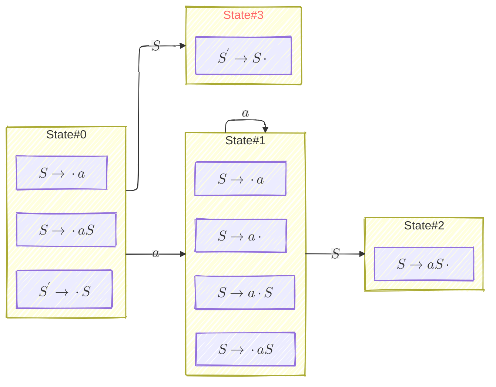
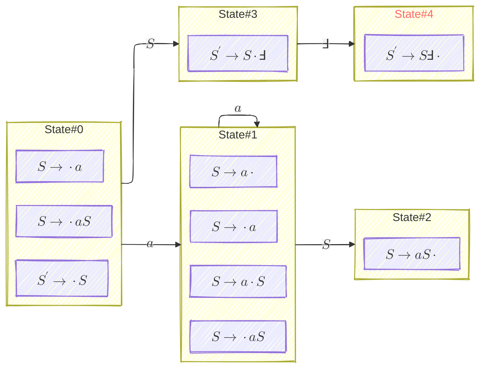

# 1. $LR(0)$ Parsing Table Construction

Recall [LR Parsing #2: Structural Encoding of LR(0) Parsing DFA](/compiler/2025/07/18/lr-parsing-2-structural-encoding-of-lr0-parsing-dfa) and compute the Canonical Collection of Set of $LR(0)$ Items $C$ for the augmented grammar $G' = (V, \Sigma, S', P)$:

$$
C = \operatorname{CC}(G') = \lbrace I_0, I_1, \dots, I_n \rbrace
$$

Number the productions from $1$ to $m$ where $m = \vert P \vert$.

Make two tables, $T_{\operatorname{ACTION}}$ and $T_{\operatorname{GOTO}}$, as in [Knuth’s Parsing Table](/compiler/2025/07/21/lr-parsing-3-simulation-of-parsing-dfa#4-how-to-interpret-a-parsing-table-lets-start-with-knuths-parsing-table). Or you can think them as two functions:

$$
\begin{align}
\operatorname{ACTION}:& \; C \times (\Sigma \cup \lbrace \Finv \rbrace) \to \lbrace \text{"shift"}, \text{"reduce 1"}, \dots \text{"reduce m"}, \text{"accept"} \rbrace \newline
\operatorname{GOTO}:& \; C \times (V \cup \Sigma) \to C
\end{align}
$$

where $\Finv$ is the EOF symbol, and $\operatorname{GOTO}$ function is exactly the same one we talked about in [LR Parsing #2: Structural Encoding of LR(0) Parsing DFA](/compiler/2025/07/18/lr-parsing-2-structural-encoding-of-lr0-parsing-dfa).

$\forall I_i \in C$, fill the $LR(0)$ parsing table following the rules below: 

| **Rule** |**Condition**                                               |**Table Construction**                                                          |
|---|------------------------------------------------------------|---------------------------------------------------------------------------------------|
| 1 |if $\exists a \in \Sigma$ such that $\operatorname{GOTO}(I_i, a) = I_j$ | mark $T_{\operatorname{ACTION}}[i, a] = \text{"shift"}$                           |
|   |                                                                        | mark $T_{\operatorname{GOTO}}[i, a] = j$                                          |
| 2 |if $\exists A \in V$ such that $\operatorname{GOTO}(I_i, A) = I_j$      | mark $T_{\operatorname{GOTO}}[i, A] = j$                                          |
| 3 |if $\exists [S' \to S \cdot] \in I_i$                                   | mark $T_{\operatorname{ACTION}}[i, \Finv] = \text{"accept"}$                      |
| 4 |if $\exists [A \to \alpha \cdot] \in I_i$, $A \neq S'$, and $A \to \alpha$ is production $k$   | $\forall e \in \Sigma \cup \lbrace \Finv \rbrace$, mark $T_{\operatorname{ACTION}}[i, e] = \text{"reduce k"}$|

All entries not marked by the procedure can be considered $\text{"error"}$, and indicate that the input string is not accepted by the grammar.
{: .notice--info}

We can see that $\operatorname{GOTO}$ function and $T_{\operatorname{GOTO}}$ table are essentially the same thing.
{: .notice--info}

Note that for Rule 3:

- If you augment grammar $G$ into $G'$ with $S' \to S$, then $[S' \to S \cdot]$ is the accepting position
- If you augment grammar $G$ into $G'$ with $S' \to S \Finv$, then $[S' \to S \cdot \Finv]$ is the accepting position
- These two notations mean the same thing; the only difference is how they look on the surface. 
    - However the latter makes $T_{\operatorname{ACTION}}[i, \Finv]$ easier to understand (since $[S' \to S \cdot \Finv]$ is a position explicitly expecting $\Finv$)

Note that for Rule 4:

- You can treat Rule 3 as a special case of Rule 4
- I.e. $\text{"accept"}$ is exactly a $\text{"reduce"}$ to $S'$, right before $\Finv$ 

Note that for Rule 1, modern parsing tables would combine the two table entries into one:

| **Rule** |**Condition**                                               |**Table Construction**                                          |
|---|------------------------------------------------------------|-----------------------------------------------------------------------|
| 1 |if $\exists a \in \Sigma$ such that $\operatorname{GOTO}(I_i, a) = I_j$ | mark $T_{\operatorname{ACTION}}[i, a] = \text{"shift j"}$ |

and in this way, the nature of the two tables have changed accordingly:

$$
\begin{align}
T_{\operatorname{ACTION}}:& \; C \times (\Sigma \cup \lbrace \Finv \rbrace) \to \lbrace \text{"shift 0"}, \dots, \text{"shift n"}, \text{"reduce 1"}, \dots \text{"reduce m"}, \text{"accept"} \rbrace \newline
T_{\operatorname{GOTO}}:& \; C \times V \to C
\end{align}
$$

# 2. $SLR(1)$ Parsing Table Construction

Note that $SLR$ and $SLR(1)$ are interchangable, and there is no other $SLR(k)$ where $k \neq 1$.
{: .notice--info}

$SLR(1)$ differs with $LR(0)$ on Rule 4. For $SLR(1)$, we have:

| **Rule** |**Condition**                                               |**Table Construction**                                                          |
|---|------------------------------------------------------------|---------------------------------------------------------------------------------------|
| 4 |if $\exists [A \to \alpha \cdot] \in I_i$, $A \neq S'$, and $A \to \alpha$ is production $k$   | $\forall e \in \operatorname{FOLLOW}(A)$, mark $T_{\operatorname{ACTION}}[i, e] = \text{"reduce k"}$|

# 3. Shift-Reduce Conflicts

$T_{\operatorname{GOTO}}$ is impossible to have conflicts.

$T_{\operatorname{ACTION}}$ may have conflicts, the most common being _shift-reduce_ conflicts, i.e. one entry $T_{\operatorname{ACTION}}(I_i, a)$ may have two values, a $\text{"shift"}$ and a $\text{"reduce k"}$.

It's impossible to have _shift-shift_ conflicts in $T_{\operatorname{ACTION}}$.
{: .notice--info}

_Reduce-reduce_ conflicts are possible but kinda rare. E.g. when you grammar has both $A \to a$ and $B \to a$, how do you reduce $a \rhd ?$
{: .notice--info}

**Theorem:** If any conflicting actions result from $LR(0)$ parsing table construction, we say the grammar is not $LR(0)$. $\blacksquare$

**Theorem:** If any conflicting actions result from $SLR(1)$ parsing table construction, we say the grammar is not $SLR(1)$. $\blacksquare$

# 4. $LR(0)$ vs $SLR(1)$

**Theorem:** Every $LR(0)$ grammar is $SLR(1)$. $\blacksquare$

The following grammar is $SLR(1)$ but not $LR(0)$:

```ebnf
S' -> S   // production 1
S -> a S  // production 2
S -> a    // production 3
```



"State#3" in red font represents the accept state.
{: .notice--info}

If we construct a $LR(0)$ parsing table for the grammar, we'll get:

|State#|ACTION               |           |GOTO|    |
|------|---------------------|-----------|----|----|
|      | $a$                 | $\Finv$   | $a$| $S$|
|$0$   | _shift_             |           |$1$ |$3$ |
|$1$   | _shift_ / _reduce 3_| _reduce 3_|$1$ |$2$ |
|$2$   | _reduce 2_          | _reduce 2_|    |    |
|$3$   |                     | _accept_  |    |    |

The conflict at $T_{\operatorname{ACTION}}(I_1, a)$ is a dilemma at such a configuration:

$$
\big[ (\_, I_0), (a, I_1) \big] \mid a
$$

- you can either _shift_ the input $a$ (according to $[S \to \cdot a S]$)
- or _reduce_ the current $a$ on stack top (according to $[S \to \cdot a]$)

If we construct a $SLR(1)$ parsing table for the grammar, we'll get:

|State#|ACTION      |           |GOTO|    |
|------|------------|-----------|----|----|
|      | $a$        | $\Finv$   | $a$| $S$|
|$0$   | _shift_    |           |$1$ |$3$ |
|$1$   | _shift_    | _reduce 3_|$1$ |$2$ |
|$2$   | _reduce 2_ | _reduce 2_|    |    |
|$3$   |            | _accept_  |    |    |

since $\operatorname{FOLLOW}(S) = \lbrace \Finv \rbrace$ and therefore for the $I_0$ row, only $T_{\operatorname{ACTION}}(I_1, \Finv)$ is marked _reduce_.

It means at the same configuration:

$$
\big[ (\_, I_0), (a, I_1) \big] \mid a
$$

$SLR(1)$ will prefer _shifting_ in a new $a$ over _reducing_ the current $a$ on stack top.

# 5. Digression: Different Representation of DFA and Parsing Table

[ComVis](https://comvis.pr.ac.rs/lr0-parser.jsp) will represent our DFA as:



and the corresponding $SLR(1)$ parsing table would be like:

|State#|ACTION      |           |GOTO|
|------|------------|-----------|----|
|      | $a$        | $\Finv$   | $S$|
|$0$   | _shift 1_  |           | $3$|
|$1$   | _shift 1_  | _reduce 3_|$2$ |
|$2$   | _reduce 2_ | _reduce 2_|    |
|$3$   |            | _shift 4_ |    |
|$4$   | _accept_   | _accept_  |    |