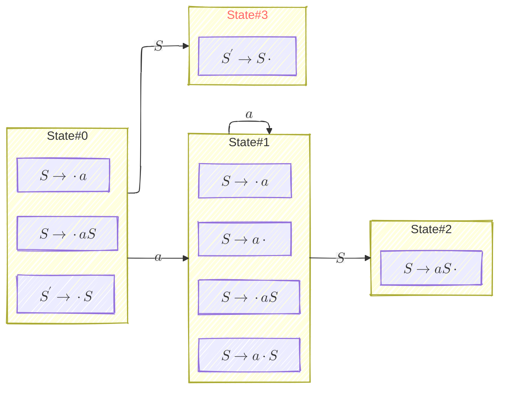
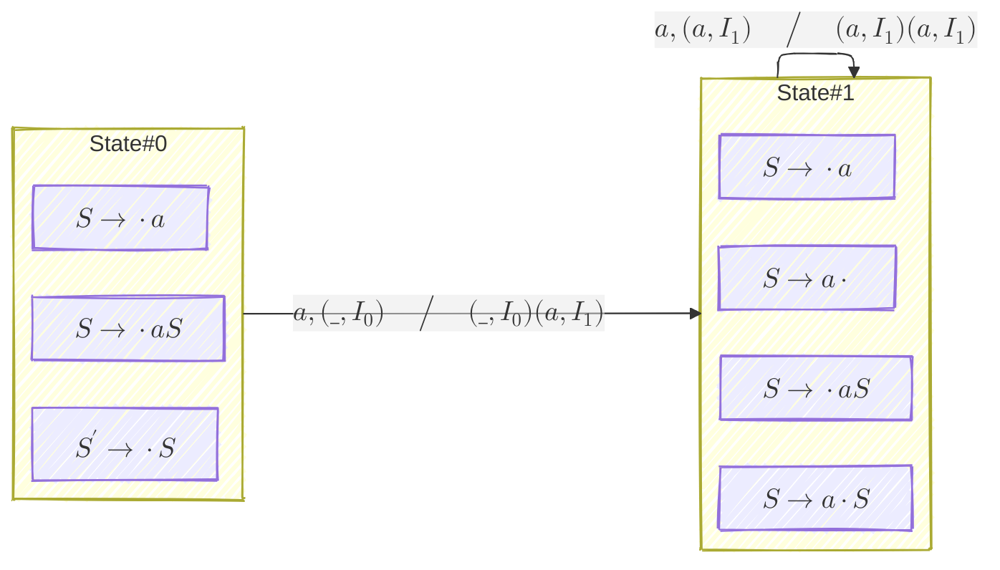
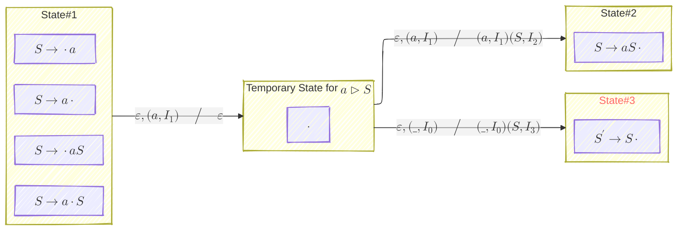
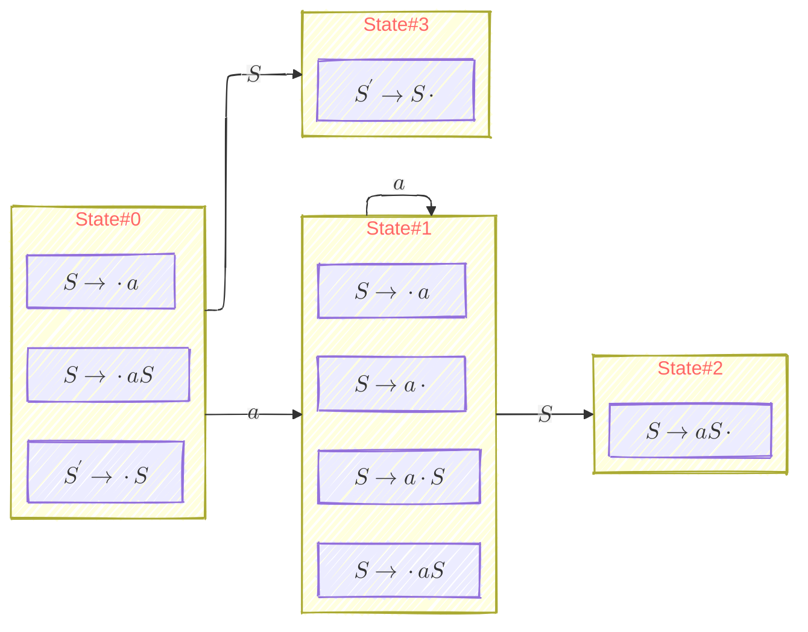

# 1. Questionable DFA

迄今为止，我们这个系列的思路是这样的：

- [LR Parsing #1: Intuition](/compiler/2025/07/17/lr-parsing-1-intuition):
    - stack 上的是 viable prefix
    - viable prefixes 构成 regular language
    - regular langunage 于是有 DFA
- [LR Parsing #2: Structural Encoding of LR(0) Parsing DFA](/compiler/2025/07/18/lr-parsing-2-structural-encoding-of-lr0-parsing-dfa)
    - 如何构建这个 DFA
- [LR Parsing #4: Runtime Encoding of LR(0)/SLR(1) Parsing DFA (How to Construct the Parsing Tables)](/compiler/2025/07/22/lr-parsing-4-runtime-encoding-of-lr0slr1-parsing-dfa)
    - 这个 DFA 是如何运行的
- [LR Parsing #3: Simulation of the Parsing DFA (Configuration / Shift-Reduce / Structure of Parsing Table)](/compiler/2025/07/21/lr-parsing-3-simulation-of-parsing-dfa)
    - Parser 程序如何 drive 这个 DFA 运行

但我们回看一下 [LR Parsing #4: Runtime Encoding of LR(0)/SLR(1) Parsing DFA (How to Construct the Parsing Tables)](/compiler/2025/07/22/lr-parsing-4-runtime-encoding-of-lr0slr1-parsing-dfa) 中的这个例子：

```ebnf
S' -> S   // production 1
S -> a S  // production 2
S -> a    // production 3
```



"State#3" in red font represents the accept state.
{: .notice--info}

**Is this a real DFA?**

# 2. Parser 程序其实模拟的是 DPDA $\approx$ DFA + Stack

比如 _shift_ 就可以表示成： 



注意 $I_0 \to I_1$ 的这个 transition，标准写法应该是 $a,(\text{\_}, I_0) \big/ (a,I_1)(\text{\_}, I_0)$，stack 的 top 朝左，稍微有点别扭，于是我改成和 configuration 一样的写法。
{: .notice--info}

比如 _reduce_ $a \rhd S$ 就可以表示成： 



如果是 _reduce_ $aS \rhd S$，我们还需要更多的 temporary states，整个 DPDA 会变得很大。

这也就是 parser 程序的智慧所在：**我们不需要一个完整定义的、复杂的 DPDA，我们可以用一个简单的 DFA + Stack 等效地实现 DPDA 的效果**。

# 3. $LR$ Parsing DFA 的确能识别 Viable Prefixes，但需要一点改动

这个改动就是把 $LR$ Parsing DFA 的 states 全部设置成 accept states:



Any state in red font is an accept state.
{: .notice--info}

特别地，$\varepsilon$ 是一个合法的 viable prefix.