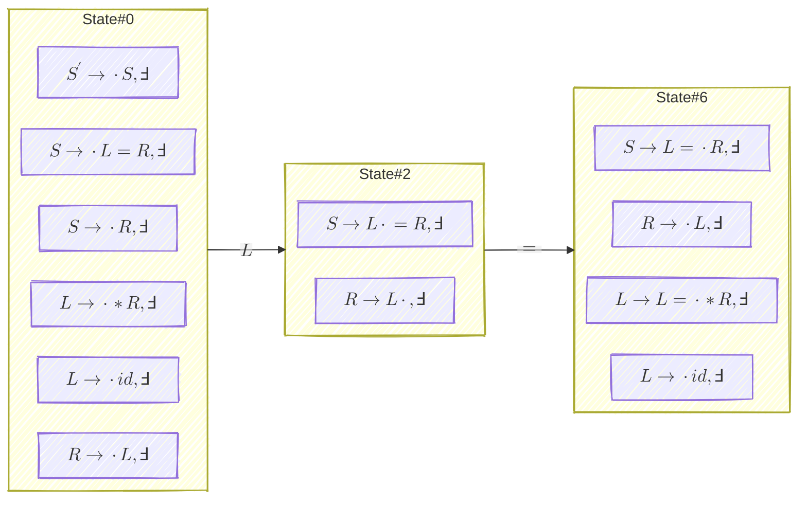
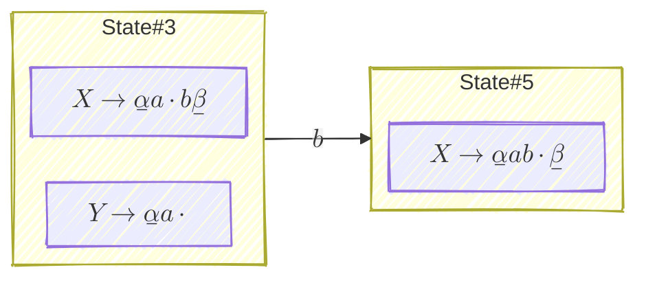
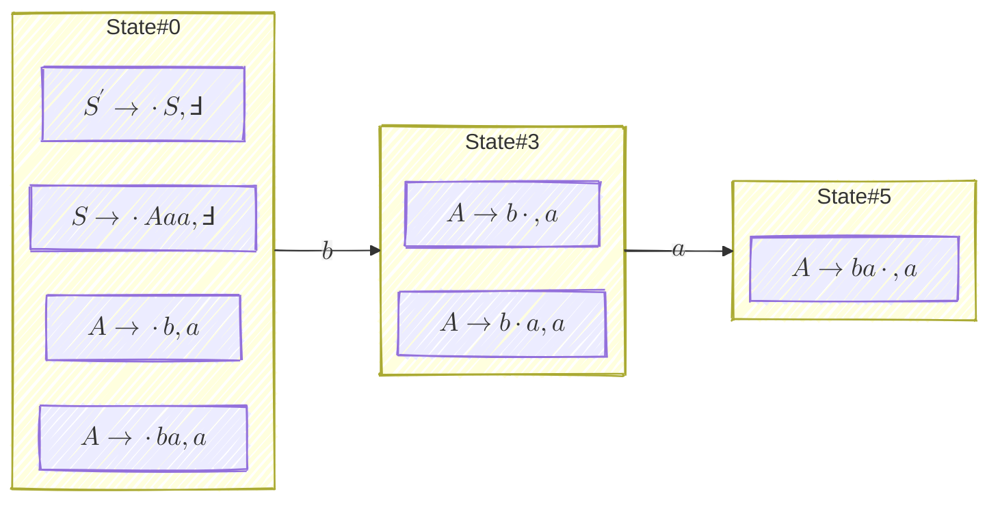

- Reference: [SLR and LR(1) Parsing](https://web.stanford.edu/class/archive/cs/cs143/cs143.1128/handouts/110%20LR%20and%20SLR%20Parsing.pdf)
- Online Tool: [JSMachines LR(1) Parser Generator](https://jsmachines.sourceforge.net/machines/lr1.html)

# 1. The DFA Perspective

## 1.1 Comparison

This is a classic example in compiler theory that clearly separates $LR(1)$ from $SLR(1)$ and $LR(0)$:

```ebnf
S' -> S     // production 1
S -> L = R  // production 2
S -> R      // production 3
L -> * R    // production 4
L -> id     // production 5
R -> L      // production 6
```

or more technically:

```g4
// Start rule
S : L '=' R              # Assignment
  | R                    # ExpressionOnly
  ;

// Left-hand side
L : '*' L                # Dereference
  | ID                   # Identifier
  ;

// Right-hand side
R : L                    # RHS
  ;

// Lexer rules
ID : [a-zA-Z_][a-zA-Z_0-9]* ;
```

You can think of the $\ast$ above as the dereference operator on pointers in C.
{: .notice--info}

Consider input $w = \overline{\text{id} = \text{id}}$. When the first $\text{id}$ is reduced to $L$, we'll have the following configuration:

$$
\big[ (\_, \mathcal{S_0}), (L, \mathcal{S_2}) \big] \; \mid \; = \text{id}
$$

There is a dilemma for $LR(0)$ parsing:

- you can further reduce $L \rhd R$ (by production $6$)
- or shift the $=$ into the stack (by production $2$)

$SLR(1)$ tries to fix this problem but in vain, because:

- $\operatorname{FOLLOW}(L) = \lbrace =, \Finv\rbrace$ because:
    - $S \Rightarrow L = R$
    - $S \Rightarrow R \Rightarrow L$
- Therefore $SLR(1)$ will still advice reducing $L \rhd R$ on reading $=$ (by production $6$)
- Meanwhile   shifting the $=$ into the stack is still possible (by production $2$)

$LR(1)$ solves this problem by having the following states:



- When in `State#2`, $LR(1)$ parser will surely shift $=$ into `State#6`
- Reduction $L \rhd R$ is only possible on reading a $\Finv$

## 1.2 General Form of _Shift-Reduce_ Conflicts?

Discussion in this section is totally based on my experience and thus quite informal.
{: .notice--warning}

It looks like a general form of _shift-reduce_ conflicts is like this:



where:

- a shifting item and a reducing item (on the same non-terminal) exist in the same state
- it's possible that $X = Y$

If we define:

- $\operatorname{LA}(Y, I)$ as the lookahead(s) of variable $Y$ in state $I$
- $\operatorname{LA}(Y)$ as the union of lookahead(s) of variable $Y$ across all states

we can consider that, following [Section 2.2](#22-operatornamefollowl-vs-operatornamelal):

1. In $LR(0)$, $\operatorname{LA}(Y, I_3) = \Sigma \Longrightarrow \mathbb{P}(\text{conflict}) = \mathbb{P}(b \in \Sigma) = 100\%$ (inevitable)
2. In $SLR(1)$, $\operatorname{LA}(Y, I_3) = \operatorname{FOLLOW}(Y) \Longrightarrow  \mathbb{P}(\text{conflict}) = \mathbb{P}(b \in \operatorname{FOLLOW}(Y))$ is lower
3. In $LR(1)$, $\operatorname{LA}(Y, I_3) \subseteq \operatorname{FOLLOW}(Y) \Longrightarrow \mathbb{P}(\text{conflict}) = \mathbb{P}(b \in \operatorname{LA}(Y, I_3))$ is even lower

# 2. The Parse Tree Perspective

## 2.1 Comparison

Consider the same input $w = \overline{\text{id} = \text{id}}$ with the examplar grammar above.

With $LR(1)$ parsing, the following parse tree is feasible:

```mermaid
---
config:
  look: handDrawn
---
flowchart TB
    S_0[$$S' \to \cdot S, \Finv$$]
    S_1[$$S \to \cdot L = R, \Finv$$]
    L[$$L \to \cdot id, =$$]
    R[$$R \to \cdot L, \Finv$$]
    L2[$$L \to \cdot id, \Finv$$]

    subgraph Input["input"]
        direction LR
        i0["$$id$$"] 
        i1["$$=$$"] 
        i2["$$id$$"]
        i3["$$\Finv$$"]
    end

    S_0 ~~~ S_1 --> S_0
    S_1 ~~~ S_0

    S_1 ~~~ L --> S_1
    L ~~~ S_1
    
    S_1 ~~~ R --> S_1
    R ~~~ S_1

    L ~~~ i0 --> L
    i0 ~~~ L

    L ~~~ i1 -.✅.-> L
    i1 ~~~ L

    S_1 ~~~ i1 --> S_1
    i1 ~~~ S_1

    R ~~~ L2 --> R
    L2 ~~~ R

    L2 ~~~ i2 --> L2
    i2 ~~~ L2

    L2 ~~~ i3 -.✅.-> L2
    i3 ~~~ L2

    R ~~~ i3 -.✅.-> R
    i3 ~~~ R
    
    S_1 ~~~ i3 -.✅.-> S_1
    i3 ~~~ S_1
```



Meanwhile the following parse tree is precluded due to the lookahead mismatch: 

```mermaid
---
config:
  look: handDrawn
---
flowchart TB
    S_0[$$S' \to \cdot S, \Finv$$]
    S_1[$$S \to \cdot R, \Finv$$]
    L[$$L \to \cdot id, \Finv$$]
    R[$$R \to \cdot L, \Finv$$]

    subgraph Input["input"]
        direction LR
        i0["$$id$$"] 
        i1["$$=$$"] 
        i2["$$id$$"]
        i3["$$\Finv$$"]
    end

    S_0 ~~~ S_1 --> S_0
    S_1 ~~~ S_0

    S_1 ~~~ R --> S_1
    R ~~~ S_1
    
    R ~~~ L --> R
    L ~~~ R

    L ~~~ i0 --> L
    i0 ~~~ L

    L ~~~ i1 -.❌.-> L
    i1 ~~~ L
```



The lookahead in $LR(1)$ plays a protective role in the parsing that can be considered as:

- a **sentinel** that guards against invalid reduction, or wrong shapes of the parse tree
- a **postcondition** that ensures the rest of the input is still parsable

Compared to $LR(1)$:

- $LR(0)$ parsing cannot preclude the second parse tree above from construction, because **it has no such protection mechanism** at all.
- $SLR(1)$ parsing cannot either because **its protection mechanism is weak**.

## 2.2 $\operatorname{FOLLOW}(L)$ vs $\operatorname{LA}(L)$

$SLR(1)$ parsing with the above example will allow the following parse tree, where $\operatorname{FOLLOW}(L)$ can be considered as a set of "lookaheads":

```mermaid
---
config:
  look: handDrawn
---
flowchart TB
    S_0[$$S' \to \cdot S$$]
    S_1[$$S \to \cdot R$$]
    L[$$L \to \cdot id, \lbrace \Finv, = \rbrace$$]
    R[$$R \to \cdot L$$]

    subgraph Input["input"]
        direction LR
        i0["$$id$$"] 
        i1["$$=$$"] 
        i2["$$id$$"]
        i3["$$\Finv$$"]
    end

    S_0 ~~~ S_1 --> S_0
    S_1 ~~~ S_0

    S_1 ~~~ R --> S_1
    R ~~~ S_1
    
    R ~~~ L --> R
    L ~~~ R

    L ~~~ i0 --> L
    i0 ~~~ L

    L ~~~ i1 -.✅.-> L
    i1 ~~~ L
```



It looks like $\operatorname{FOLLOW}(L) = \lbrace \Finv, = \rbrace$ in $SLR(1)$ is the superset of $L's$ lookahead $=$ (of the same state) in $LR(1)$. Can we make such a conclusion here? Yes!

**Lemma:** $\operatorname{FOLLOW}(A) = \bigcup \operatorname{FIRST}(\beta a) \text{ for all context } [B \to \alpha \cdot A \beta, a]$. $\blacksquare$

In this way, we can consider $\forall A \in V$:

1. $LR(0)$ as having the widest range of lookaheads, i.e. $\operatorname{LA}(A) = \Sigma$
2. $SLR(1)$ as having a narrower range of lookaheads, i.e. $\operatorname{LA}(A) = \operatorname{FOLLOW}(A)$
3. $LR(1)$ as having the narrowest range of lookaheads, i.e. $\operatorname{LA}(A) \subseteq \operatorname{FOLLOW}(A)$

# 3. Digression: Propagation of Lookaheads

从 [$\operatorname{GOTO}^{(1)}$](/compiler/2025/07/27/lr-parsing-6-upgrade-to-lr1#13-operatornamegoto1-rightarrow-natural-extension-of-lr0s-operatornamegoto) 的定义可以看出，lookahead 对 transition 没有任何的影响，它更像是 transition 中 carry-on 的信息：transition 你得把它带上，但是不需要用它。

lookahead 的作用更集中在 transition chain 的头和尾：initializing closure 和 determining reduction. 而 initializing 的源头又在于 $[S' \to \cdot S, \Finv]$，所以你可以把 lookaheads 理解成 $[S' \to \cdot S, \Finv]$ 埋好的 sentinels.

# 4. The Expressive Power Perspective

|Grammar |Granularity of Parsing Table Construction Rules|Possibility of Conflicts|so a conflict-free grammar must be ... structually|Expressive Power|
|--------|-----------------------------------------------|------------------------|--------------------------------------------------|----------------|
|$LR(0)$ | Coarse                                        | 🔴 High                | most restrictive                                 | 🟢 Low         |
|$SLR(1)$| Medium                                        | 🟡 Medium              | medium restrictive                               | 🟡 Medium      |
|$LR(1)$ | Fine                                          | 🟢 Low                 | least restrictive                                | 🔴 High        |

# 5. Beyond $LR(1)$

First of all, $LR(1)$ cannot fix [ambiguity](/compiler/2025/06/22/appetizer-2-before-parsing-cfg-disambiguation).

You definitely can design a unambiguous grammar that has _reduce-reduce_ conflicts even with $LR(1)$ parsing. (See [LR Parsing #4](/compiler/2025/07/22/lr-parsing-4-runtime-encoding-of-lr0slr1-parsing-dfa#3-shift-reduce-conflicts))

The following grammar is unambiguous and have a _shift-reduce_ conflicts. 

```ebnf
S' -> S
S -> A a a
A -> b
A -> b a
```

Consider input $w = baa$. When the first $b$ is shifted in, we'll have the following configuration:

$$
\big[ (\_, \mathcal{S_0}), (b, \mathcal{S_3}) \big] \; \mid \; a a
$$

There is a dilemma even for $LR(1)$ parsing:

- you can choose to reduce $b \rhd a$ 
- or shift the $a$ into the stack



