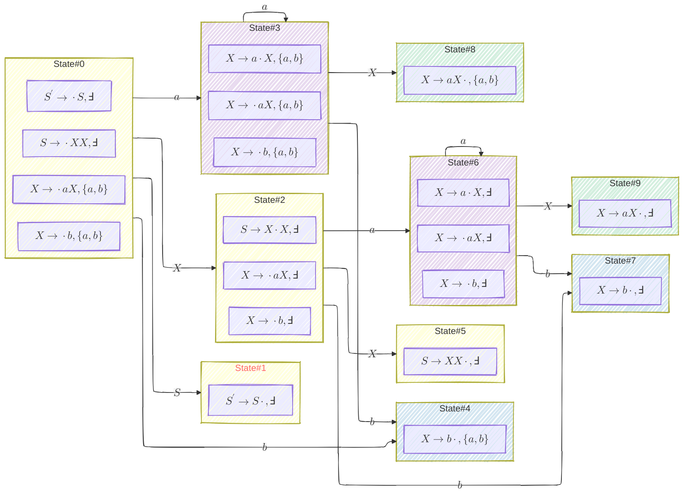
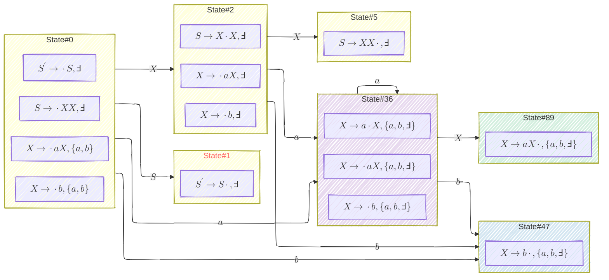
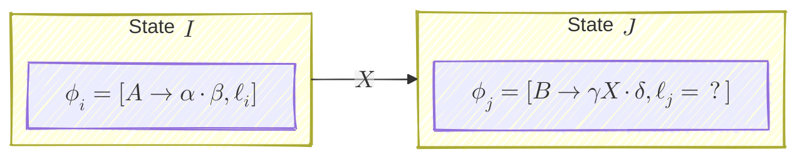

Reference: 

- [Stanford CS143 Handout 14 - LALR Parsing](https://web.stanford.edu/class/archive/cs/cs143/cs143.1128/handouts/140%20LALR%20Parsing.pdf)
- [_Parsing Techniques_, 2nd Edition](https://www.amazon.com/Parsing-Techniques-Practical-Monographs-Computer/dp/1441919015)

# 1. Intuition & Example

$LR(1)$ 有一个很明显的问题就是 item/state space 的爆炸式增长；$LALR(1)$ 的想法是 "to merge $LR(1)$ states with the same _core_ by combining their lookaheads, thus lowering the total count of states".

这里需要正式定义一下 _core_:

**Definition:** The **core** of an $LR(1)$ state is its $LR(0)$ items (i.e. the item set with their lookaheads dropped). $\blacksquare$

注意与 kernel item 区分。
{: .notice--info}

所以如果两个 $LR(1)$ states 的 core 相同，$LALR(1)$ 认为它们就可以合并，合并的方式是把相同 item 的 lookaheads 取 union.

举个例子：

```ebnf
S' -> S
S -> XX
X -> aX
X -> b
```



"State#1" in red font represents the accept state. States with the same non-white backgraound color are mergeable by $LALR(1)$.
{: .notice--info}

$LALR(1)$ 认为 `State#3 + State#6`、`State#4 + State#7`、`State#8 + State#9` 可以合并，于是得到：



合并后是有可能直接变成 $SLR(1)$ 的。
{: .notice--info}

# 2. Conflicts Emerged after Merging / Partially $LALR(1)$?

合并 state 必然会增加 conflict 的 possibility:

- conflicting 的两个 items 如果是分开的两个 states 中的，就没事
- 一合并就必然出事

**Theorem:** When a conflict arises after state merging, we say the grammar is not $LALR(1)$. $\blacksquare$

按照 [LR Parsing #7: LR(0) vs SLR(1) vs LR(1) - 4. The Expressive Power Perspective](/compiler/2025/07/30/lr-parsing-7-lr0-vs-slr1-vs-lr1#4-the-expressive-power-perspective) 的思路，有：

|Grammar  |Possibility of Conflicts|so a conflict-free grammar must be ... structually|Expressive Power|
|---------|------------------------|--------------------------------------------------|----------------|
|$LR(0)$  | 🎲🎲🎲🎲 High           | 🚫🚫🚫🚫 most restrictive                          | 👑 Low         |
|$SLR(1)$ | 🎲🎲🎲                  | 🚫🚫🚫                                            | 👑👑            |
|$LALR(1)$| 🎲🎲                    | 🚫🚫                                              | 👑👑👑         |
|$LR(1)$  | 🎲 Low                 | 🚫 least restrictive                              | 👑👑👑👑 High   |

为了避免出现 conflict，我有一个 rough 的 idea：只合并那些不会有 conflict 的 states；有 conflict 的 states 我们不合并就好了。这么一来就得到了一种 half-$LR(1)$-half-$LALR(1)$ 的形态。

学界的工作做得比我这个 rough idea 更细致，比如 [$IELR(1)$](https://www.sciencedirect.com/science/article/pii/S0167642309001191)，这里就不展开了。

# 3. Parsing Table Construction

Same with $LR(1)$'s.

# 4. State-Merging Algorithms

## 4.0 老算法改造

[之前的算法](https://listcomp.com/compiler/2025/07/27/lr-parsing-6-upgrade-to-lr1) 有这么几个问题：

1. $\operatorname{GOTO}^{(1)}$ 职责上稍微有点不清晰：
    - 它要负责创建新的 closure
    - 同时它又是 $T_{\operatorname{GOTO}}$ 填表的依据
2. $\text{repeat until } C \text{ is not changed}$ 没有一个具体的、高效的实现手段

我们可以这么改造一下：

$$
\begin{align}
&\text{// compute the canonical collection of item sets for grammar } G' \qquad \newline 
&\textbf{procedure } \mathrm{CC}^{(1)}(G') \text{ -> Set[Set[Item]]:} \nonumber \qquad \newline
& \qquad i = [S' \to \cdot S, \Finv] \quad \text{// initial kernel item from the dummy production } \qquad \newline
& \qquad I = \operatorname{CLOSURE}^{(1)}(\lbrace i \rbrace) \quad \text{// initial item set} \qquad \newline
& \qquad C = \lbrace I \rbrace \quad \text{// initial canonical collection} \qquad \newline
& \qquad UQ = \text{Queue(). append}(I) \quad \text{// unvisited item sets} \qquad \newline
& \qquad \newline
& \qquad \text{repeat until } UQ \text{ is empty} \text{: }\qquad \newline 
& \qquad\qquad I = UQ\text{. popleft()} \quad \text{// visiting the first item set in the queue} \qquad \newline  
& \qquad\qquad \text{for each symbol } X \text{: } \qquad \newline
& \qquad\qquad\qquad J = \operatorname{GOTO}^{(1)}(I, X) \qquad \newline
& \qquad\qquad\qquad \text{if } J = \varnothing \text{: } \qquad \newline 
& \qquad\qquad\qquad\qquad \text{continue}  \qquad \newline 
& \qquad\qquad\qquad \text{if } J \not\in C \text{: } \qquad \newline 
& \qquad\qquad\qquad\qquad \text{// } J \text{ is not empty, and new to C} \qquad \newline 
& \qquad\qquad\qquad\qquad \text{// should be marked as unvisited} \qquad \newline 
& \qquad\qquad\qquad\qquad C\text{. add}(J) \qquad \newline
& \qquad\qquad\qquad\qquad UQ\text{. append}(J) \qquad \newline
& \qquad\qquad\qquad T_{\operatorname{GOTO}}[I, X] = J \qquad \newline 
& \qquad \text{return } C
\end{align}
$$

$T_{\operatorname{ACTION}}$ 填表放到 $\operatorname{CC}^{(1)}$ 结束之后再做。

## 4.1 Brute-Force

即在 $\operatorname{CC}^{(1)}$ 结束之后再去 scan $C$ 寻找可以合并的 item sets，而且还要去改动 $T_{\operatorname{GOTO}}$，程序写起来很麻烦。

但是如果是做练习题，这个方法还行，而且 $T_{\operatorname{GOTO}}$ 有个规律可以用：

1. 假设我们构建好了 $LR(1)$ 的 $C = \lbrace I_0, I_1, \dots, I_n \rbrace$
2. For each core $\in C$, find all item sets having that core, and compute their union, say $J_x = \bigcup \kappa_x$ where $\kappa_x = \lbrace I_i \in C \mid \operatorname{core}(I_i) = \text{the x-th core in } C\rbrace$
3. 假设 step 2 的结果是 $C' = \lbrace J_0, J_1, \dots, J_m \rbrace$:
    - $T_{\operatorname{GOTO}} \Longrightarrow$ 
        - 如果 $J_p = I_i \cup \dots \cup I_k$，那么 $\forall X$, $\operatorname{GOTO}^{(1)}(I_i, X), \dots \operatorname{GOTO}^{(1)}(I_k, X)$ 也应该有相同的 core，所以你肯定能找到一个 $J_q = \operatorname{GOTO}^{(1)}(I_i, X) \cup \dots \cup \operatorname{GOTO}^{(1)}(I_k, X) \in C'$. 于是我们可以删除 $T_{\operatorname{GOTO}}(I_i, X), \dots T_{\operatorname{GOTO}}(I_k, X)$，然后添加 $T_{\operatorname{GOTO}}(J_p, X) = J_q$
            - [Section 1](#1-intuition--example) 就是个很好的例子
        - $\forall T_{\operatorname{GOTO}}(?, ?) = I_i \text{ or } \dots \text{ or } I_k$ 都要改成 $T_{\operatorname{GOTO}}(?, ?) = J_p$
    - $T_{\operatorname{ACTION}} \Longrightarrow$ 与 $LR(1)$ 的方法一致

## 4.2 A simple algorithm: step-by-step merging

First described by [Anderson et al. in 1973](https://link.springer.com/article/10.1007/BF00571461).
{: .notice--info}

$$
\begin{align}
&\text{// compute the canonical collection of item sets for grammar } G' \qquad \newline 
&\textbf{procedure } \mathrm{CC\_LALR}^{(1. 1)}(G') \text{ -> Set[Set[Item]]:} \nonumber \qquad \newline
& \qquad i = [S' \to \cdot S, \Finv] \quad \text{// initial kernel item from the dummy production } \qquad \newline
& \qquad I = \operatorname{CLOSURE}^{(1)}(\lbrace i \rbrace) \quad \text{// initial item set} \qquad \newline
& \qquad C = \lbrace I \rbrace \quad \text{// initial canonical collection} \qquad \newline
& \qquad UQ = \text{Queue(). append}(I) \quad \text{// unvisited item sets} \qquad \newline
& \qquad \newline
& \qquad \text{repeat until } UQ \text{ is empty} \text{: }\qquad \newline 
& \qquad\qquad I = UQ\text{. popleft()} \quad \text{// visiting the first item set in the queue} \qquad \newline  
& \qquad\qquad \text{for each symbol } X \text{: } \qquad \newline
& \qquad\qquad\qquad J = \operatorname{GOTO}^{(1)}(I, X) \qquad \newline
& \qquad\qquad\qquad \text{if } J = \varnothing \text{: } \qquad \newline 
& \qquad\qquad\qquad\qquad \text{continue}  \qquad \newline 
& \qquad\qquad\qquad \text{if } \exists K \in C \text{ such that } \operatorname{core}(K) = \operatorname{core}(J) \text{: } \quad \text{// 📌 able to merge} \qquad \newline
& \qquad\qquad\qquad\qquad K' = K\text{. deep\_copy}() \qquad \newline
& \qquad\qquad\qquad\qquad K' = K'\text{. merge}(J) \qquad \newline
& \qquad\qquad\qquad\qquad \text{if }K = K' \text{: } \quad \text{// no change after merging} \qquad \newline
& \qquad\qquad\qquad\qquad\qquad \text{continue} \quad \text{// discard } J \text{ and } K' \qquad \newline
& \qquad\qquad\qquad\qquad \newline
& \qquad\qquad\qquad\qquad C\text{. remove}(K) \qquad \newline
& \qquad\qquad\qquad\qquad C\text{. add}(K') \qquad \newline
& \qquad\qquad\qquad\qquad \text{// since it has chnged, it may lead to new and different states} \qquad \newline
& \qquad\qquad\qquad\qquad UQ\text{. append}(K') \qquad \newline
& \qquad\qquad\qquad\qquad \newline
& \qquad\qquad\qquad\qquad T_{\operatorname{GOTO}}[I, X] = K' \qquad \newline 
& \qquad \text{return } C
\end{align}
$$

Notes on 📌:

- 你只可能找出 only one such $K$，如果有多个的话，它们理应已经被 merge 了
- 这里你可能需要一个 `map(core, item_set)`，查找比较方便

Cons:

- still generates almost all $LR(1)$ states (现实中 $LR(1)$ 大几千个 states 被合并成 $LALR(1)$ 几百个 states 的情况是很常见的，> 10:1 ratio)
- $K'$ 需要 revisit 的频率很高，还是有很多重复的计算

## 4.3 The Channel Algorithm (used by _yacc_)

Described in [YACC: Yet Another Compiler-Compiler](https://www.cs.utexas.edu/~novak/yaccpaper.htm) by Stephen C. Johnson; detailed by Aho, Sethi and Ullman in the _Dragon Book_.
{: .notice--info}

### 4.3.0 Intuition: A channel is a passage in the the LR(0) NFA that carries over lookaheads (among items)

With this example grammar:

```ebnf
// A non-LR(0) grammar for differences of numbers
S -> E
E -> E - T
E -> T
T -> n
T -> (E)
```

the book _Parsing Techniques_ constructed a NFA for it:


and lookaheads are carried over by two types of channels within the NFA:


- $\square$ is like a placeholder for lookaheads
- dotted lines represent <span style="color:LightCoral">"propagated"</span> channel
- dashed lines represent <span style="color:ForestGreen">"spontaneous"</span> channel

But in reality you don't need to run the _Channel Algorithm_ on NFAs like this. Actually it's easier to work on DFAs.

The skeleton of the _Channel Algorithm_ is like:

1. Compute all $LR(0)$ kernel items
2. Compute the lookaheads (by channels) for those kernel items, making them $LALR(1)$ kernel items
3. Expand those $LALR(1)$ kernel items into $LALR(1)$ item sets by $\operatorname{CLOSURE}^{(1)}$

### 4.3.1 Compute $LR(0)$ Kernel Items

**Definition:** 

- **Kernel items:** the initial item $[S' \to \cdot S]$, plus all items whose dots are not at the left end
- **Non-kernel items:** all other items with their dots at the left end, except for $[S' \to \cdot S]$

$\blacksquare$

An item set may have $k > 1$ kernel items.
{: .notice--info}

You can use the $\operatorname{CC}$ procedure of [LR Parsing #2: Structural Encoding of LR(0) Parsing DFA](/compiler/2025/07/18/lr-parsing-2-structural-encoding-of-lr0-parsing-dfa) to compute all $LR(0)$ items and then remove the non-kernel ones. Otherwise you can modify the procedure so that every kernel item is marked whenever it's created.

### 4.3.2 Lookahead Determining Algorithm

首先我们要定义两种不同的 channel，或者说两种不同的 lookahead-attachment (to kernels) 的形式。

我**强烈不建议**参考 _Dragon Book_ 的 Example 4.61 下的两个 bullet points，**那根本就不是 formal definition**，是针对 Example 4.61 的特殊情况的讨论。**而且也不要试图去 interpret**，因为你很难确定它讲的 "regardless of $a$"、"only because" 这些词是什么意思。**请直接跳过去 Algorithm 4.62**。
{: .notice--danger}

参考 _Dragon Book_ 的 Algorithm 4.62. Let:

- $\lozenge$ be a symbol $\not \in \Sigma$.
- $I$ be an $LR(0)$ item set
- $\ker(I)$ be the set of kernel items of $I$
- $X$ be a symbol
- $\operatorname{GOTO}(I, X) = J$
- $SL : \operatorname{Set}[\operatorname{Tuple(I, \phi_i, J, \phi_j, b)}]$ is the result for "<span style="color:ForestGreen">spontaneously</span> generated lookaheads", where:
    - $\phi_i \in \ker(I)$ is a kernel item of $I$
    - $\phi_j \in \ker(J)$ is a kernel item of $J$
    - $b$ is a lookahead symbol
    - one such entry means: lookahead $b$ is <span style="color:ForestGreen">spontaneously</span> generated by $I$ (or more specially $\phi_i$) for $\phi_j$
- $PL : \operatorname{Set}[\operatorname{Tuple(I, \phi_i, J, \phi_j)}]$ is the result for "<span style="color:LightCoral">propagated</span> lookaheads" where:
    - one such entry means: lookaheads <span style="color:LightCoral">propagate</span> from $\phi_i$ to $\phi_j$

Textbooks use $\\#$ instead of $\lozenge$ (LaTeX `\lozenge`). I don't like escaping it all the time in Markdown so I prefer $\lozenge$. This symbol is often called **dummy lookahead** or **universal lookahead**. I also would like to call it **placebo lookahead**.
{: .notice--info}

$$
\begin{align}
&\text{// Algorithm 4.62: determine lookahead channels of } I \text{ on input } X \qquad \newline 
&\textbf{procedure } \mathrm{LAChan}(I, X) \text{:} \nonumber \qquad \newline
& \qquad J = \operatorname{GOTO}^{(1)}(I, X)  \qquad \newline
& \qquad PL = \operatorname{Set}() \qquad \newline
& \qquad SL = \operatorname{Set}() \qquad \newline
& \qquad \newline
& \qquad \text{for each kernel item } \phi_i = [A \to \alpha \cdot \beta] \in \ker(I) \text{: }\qquad \newline
& \qquad\qquad \text{patch } \phi_i \text{ to a LALR(1) item } \phi_i' = [A \to \alpha \cdot \beta, \lozenge] \qquad \newline 
& \qquad\qquad \text{let } I_{\phi_i} = \operatorname{CLOSURE}^{(1)}(\lbrace  \phi_i' \rbrace) \qquad \newline  
& \qquad \newline
& \qquad\qquad \text{if } \exists \psi_i = [B \to \gamma \cdot X \delta, \lozenge] \in I_{\phi_i} \text{: } \qquad \newline
& \qquad\qquad\qquad \text{// then certainly } \exists \phi_j = [B \to \gamma X \cdot \delta, \lozenge] \in J \qquad \newline
& \qquad\qquad\qquad \text{let } \phi_j = [B \to \gamma X \cdot \delta, \lozenge] \qquad \newline
& \qquad\qquad\qquad PL \text{ .add}(\operatorname{Tuple}(I, \phi_i, J, \phi_j)) \qquad \newline 
& \qquad\qquad \text{if } \exists \psi_i = [B \to \gamma \cdot X \delta, b] \in I_{\phi_i} \text{ and } b \neq \lozenge \text{: } \qquad \newline
& \qquad\qquad\qquad \text{// then certainly } \exists \phi_j = [B \to \gamma X \cdot \delta, b] \in J \qquad \newline
& \qquad\qquad\qquad \text{let } \phi_j = [B \to \gamma X \cdot \delta, b] \qquad \newline
& \qquad\qquad\qquad SL \text{ .add}(\operatorname{Tuple}(I, \phi_i, J, \phi_j, b)) \qquad \newline
& \qquad \text{return } PL, SL
\end{align}
$$

You don't need to keep $X$ in the results since we know $I \overset{X}{\to} J$.
{: .notice--info}

Why the dummy lookahead $\lozenge$ works? Can I replace it with some $a \in \Sigma$? 这里就涉及到了 <span style="color:LightCoral">"propagated"</span> vs <span style="color:ForestGreen">"spontaneous"</span> 的核心问题：

> 如果我们是 $\phi_i = [A \to \alpha \cdot \beta, a]$ 然后找到了 $\phi_j = [B \to \gamma X \cdot \delta, b] \in J$，那么 $a \to b$ 是 <span style="color:LightCoral">"propagated"</span> 还是 <span style="color:ForestGreen">"spontaneous"</span> 要看 "$a$ 是否**决定**了 $b$ 的值"。

举个例子：

- 比如说按 [$\operatorname{CLOSURE}^{(1)}$](/compiler/2025/07/27/lr-parsing-6-upgrade-to-lr1#12-closure-of-item-set-rightarrow-significant-changed)，我们可能会有 $b \in \operatorname{FIRST}({\beta a})$，然后假设这个 $b$ 一路传到了 $\phi_j$ unchanged
- 此时我们能说 "$a$ **决定**了 $b$ 的值" 吗？不能，因为还要继续拆：
    - 如果 $\beta$ is not nullable，那么 $b \in \operatorname{FIRST}({\beta})$，与 $a$ 无关，应该算 <span style="color:ForestGreen">"spontaneous"</span>
    - 如果 $\beta$ is nullable，那么 $b \in \operatorname{FIRST}({\beta}) \cup \lbrace a \rbrace$，与 $a$ 有关；如果最终我们得到了 $b = a$ (in $\phi_j$)，那么这应该算 <span style="color:LightCoral">"propagated"</span>

这里就涉及了一个问题：在 $\beta$ is not nullable 时，$b \in \operatorname{FIRST}({\beta})$ 也是有可能最终得到 $b = a$ (in $\phi_j$) 的，所以你从 $b \overset{?}{=} a$ 这个关系上是无法得出 "<span style="color:LightCoral">propagated</span> or <span style="color:ForestGreen">spontaneous</span>?" 的结论的。用 dummy lookahead $\lozenge$ 来 test 就完美解决了这个问题，因为：

- $\forall a \in \Sigma, \forall \beta \in (\Sigma \cup V)^{\ast}$, 不管你怎么操作都不会得出一个 $\lozenge \not \in \Sigma$
    - 换言之 $\lozenge$ 只可能是 <span style="color:LightCoral">"propagated"</span>
    - 注意这里要考虑到 $I \overset{X}{\to} J$ 实际包含了 3 步：
        1. $\operatorname{CLOSURE}^{(1)}$ to get $I$
        2. shift $X$ like $[\cdot X] \to [X \cdot]$
        3. $\operatorname{CLOSURE}^{(1)}$ to get $J$
- on the other hand，如果你拿到一个 lookahead $b \neq \lozenge$，那它的值肯定不是被 $\lozenge$ 决定的，所以一定是 <span style="color:ForestGreen">"spontaneous"</span>

**Special Case:** $\Finv$ is <span style="color:ForestGreen">"spontaneous"</span> for $[S' \to \cdot S]$
{: .notice--info}

## 4.3 Construct Channel Graph

假设我们有：


已知 $\ell_i$，求 $\ell_j$。我们可以初始化 $\ell_j = \varnothing$:

- 若 $(I, \phi_i, J, \phi_j) \in PL$, 则 $\ell_j \uplus \ell_i$
- 若 $(I, \phi_i, J, \phi_j, b) \in SL$, 则 $\ell_j \uplus \lbrace b \rbrace$

所以我们所有的 kernel items 构成一个 graph:

- vertex 形如 $(\phi_i, \ell_i)$
- edge 即是 $PL$
- $SL$ 可以理解成：
    - a visitor that generates lookahead $b$ when it reaches vertex $(\phi_j, \ell_j)$
    - a initializer of all $\ell$ values
        - 因为这个 graph 本质就是我们的 $LALR(1)$ DFA，所有的 edges 都已知，所以我们一开始就可以把 <span style="color:ForestGreen">"spontaneous"</span> lookaheads 都 assign 给对应的 kernel items
- $\phi_0 = [S \to \cdot S, \Finv]$ 构成 source vertex

所以剩下的工作就是根据 $PL$ edges 把所有的 $\ell$ 都填满就可以了，你用 DFS 或者 BFS 都行，**但要注意这仍然是一个 fixed-point 问题**，需要多次 DFS 或者 BFS 直到 $\ell$ 没有更新为止。因为：

- 你可能先处理了 $(\phi_i, \ell_i) \to (\phi_j, \ell_j)$，有 $\ell_j \uplus \ell_i$
- 但后续可能又有 $(\phi_k, \ell_k) \to (\phi_i, \ell_i)$，有 $\ell_i \uplus \ell_k$，那这个新来的 $\ell_k$ 的内容你也要更新给 $\ell_j$

_Dragon Book_ 是用这么一个 table 来记录这个 fixed-point 的计算过程的：


其中 `INIT` 就是 $SL$，后续的 `PASS` 就根据 $PL$ 来做。

## 4.4 The Relations Algorithm (Omitted)

Designed by DeRemer and Pennello ([Efficient computation of LALR(1) lookahead sets](https://dl.acm.org/doi/10.1145/69622.357187)).
{: .notice--info}

See _Section 9.7.1.3, Parsing Techniques_.

## 4.5 LALR-by-SLR Technique (Omitted)

See _Section 9.7.1.4, Parsing Techniques_.