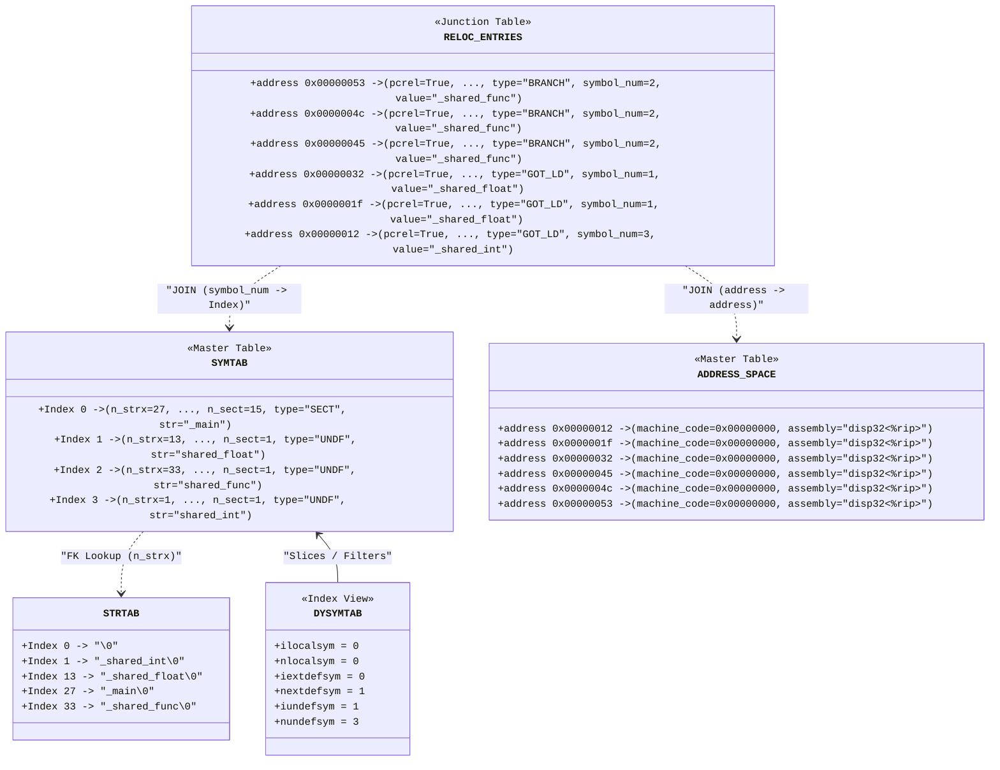

- **strtab** 本质是个 string buffer, 不是 table
- **symtab** 可以看做是个 table
    - 注意它内部的 grouping (by symbol type) 和 sorting (by symbol name; for fast binary searches)
- **dysymtab** (仅图中我们涉及的部分) 也不是个 table, 更像是 symtab 的一组 indices/pointers
- object file 本身可以看做是个 table, 以 address/offset 为 index, 以 address 上的 machine code/assembly instruction 为 value; 我们称这个 table 为 **address space**
- **relocs** 可以看做是 symtab 和 address space 的 *junction table*, 它记录的其实是 `(address, symbol, ...)` 的 *occurrences* 

这个 system design 还是很工整的。